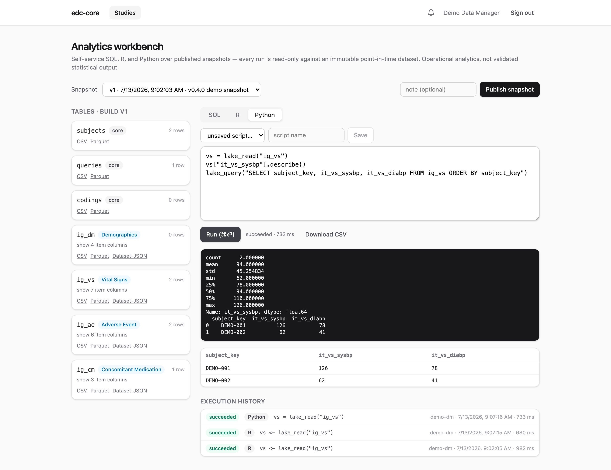

Most EDC systems make operational reporting a vendor-locked afterthought.
edc-core gives data managers **real SQL, R, and Python, inside the EDC**,
against versioned, analysis-ready study datasets.

## Snapshots

Capture happens in PostgreSQL; analysis happens on **snapshots** published
into a per-study [DuckLake](https://ducklake.select) lake (Parquet files, with
the same Postgres serving as catalog; no extra server).

Publishing a snapshot pivots the live, append-only capture data into typed
tables at the CDISC dataset grain: one table per ODM item group (`ig_vs`,
`ig_ae`, …) with columns typed from the item definitions, plus `subjects` and
`queries`. Each snapshot is pinned to a lake version: an **immutable,
point-in-time dataset**. Interim analyses and database locks reference a
snapshot ID and are reproducible indefinitely, even as capture continues.

## SQL

Pick a snapshot, browse its tables and columns in the schema panel, and query
with DuckDB SQL:

{.screenshot fig-alt="SQL workbench"}

Every run executes in a locked-down, read-only session that can only see the
selected study's snapshot (isolation is physical, at attach time, not a
convention). Results are capped at 5,000 rows with a 30-second timeout, are
downloadable as CSV, and **every execution is audited with its SQL text**.

## R and Python

The R and Python tabs send scripts to sandboxed server-side containers (R:
Rocker + plumber; Python: duckdb + pandas). Each run executes in a fresh
subprocess against the same pinned snapshot, with two helpers in scope:

```r
vs <- lake_read("ig_vs")     # a table as a data.frame
lake_query("SELECT ...")      # arbitrary DuckDB SQL, as a data.frame
```

```python
vs = lake_read("ig_vs")      # a table as a pandas DataFrame
lake_query("SELECT ...")     # arbitrary DuckDB SQL, as a DataFrame
```

Console output, the last data-frame result, and timing come back to the
browser; scripts can be **saved and versioned** per study, and the execution
history (code, logs, outputs, who and when) is retained and audited. This
directly serves ICH E6(R3)'s expectation of traceable data transformations.

{.screenshot fig-alt="R workbench with execution history"}

{.screenshot fig-alt="Python workbench with a pandas result grid"}

::: {.callout-note}
The workbench is for *operational* analytics: data cleaning status, accrual,
query aging, dataset review. It is deliberately not a validated statistical
compute environment: statistical deliverables should be produced in your
organization's validated environment from exported snapshot data.
:::

## Exports and the study archive

Any snapshot table exports as **Dataset-JSON v1.1** (the FDA-accepted,
CDISC-standard exchange format), **CSV**, or **Parquet**, straight from the
table cards above the editor. Every subject also has a **PDF casebook**, and
the **study archive** bundles the whole study (every build's ODM, all
datasets, the audit trail, signatures, casebooks) into one self-contained
zip. When to use which format, what a casebook contains, and what the
archive is for are covered on
[Exports, casebooks, and the study archive](exports-and-archive.qmd).

## Permissions

The workbench is gated by the `analytics.run` permission (data managers,
monitors, and admins by default); snapshot publication, exports, and archives
by `export.data`. Like everything else, grants are per-study and auditable.
