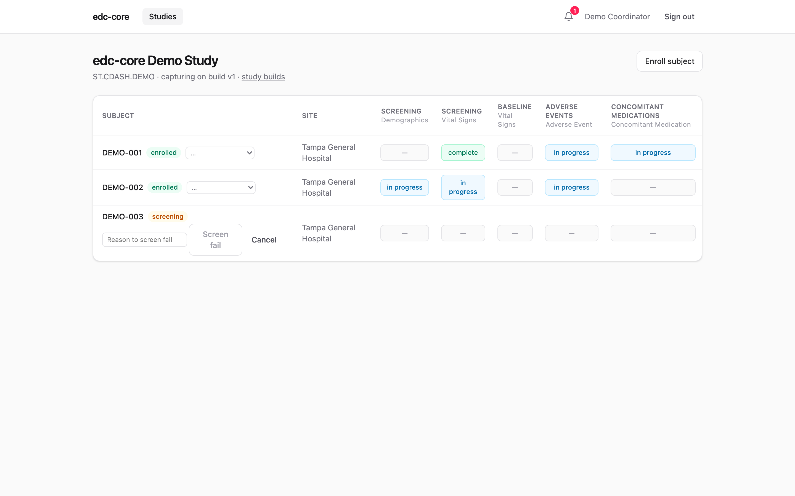
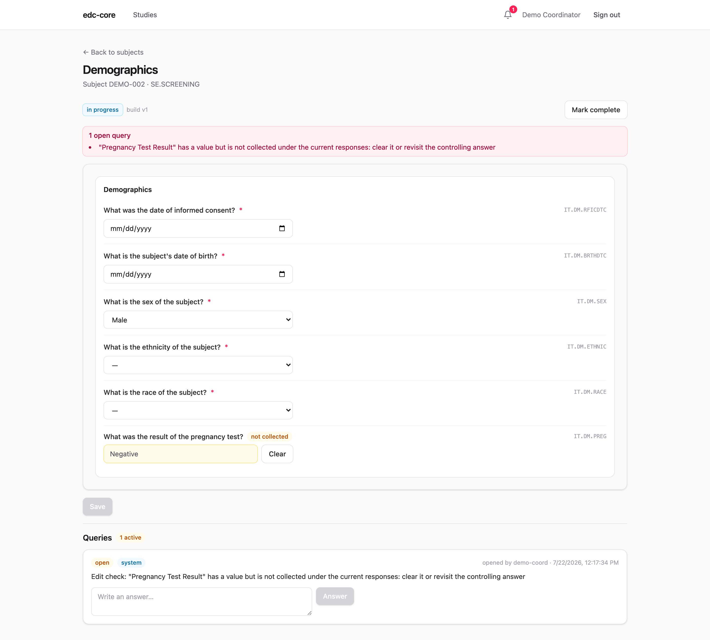
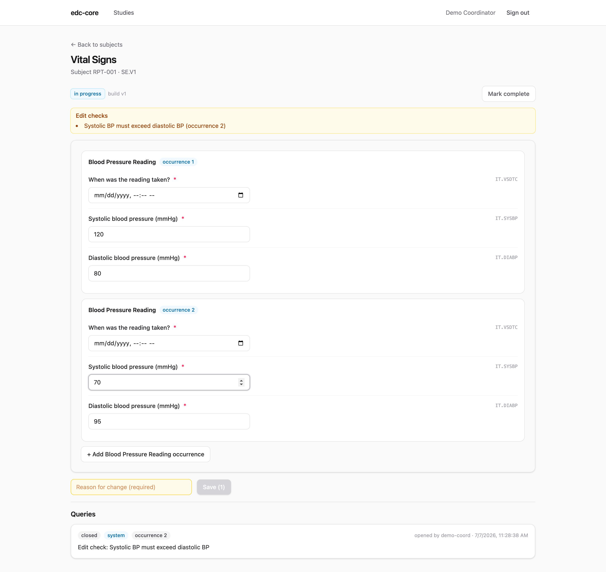

## The subject matrix

Each study's home for site staff is the subject matrix: subjects as rows,
scheduled events and forms as columns, with each cell showing that form's
workflow state. Coordinators enroll subjects here and jump straight into
entry.

{.screenshot fig-alt="Subject matrix"}

Site-scoped roles (coordinator, investigator) see only their site's subjects;
study-scoped roles (data manager, monitor) see all sites.

## Subject lifecycle

Every subject carries a lifecycle status shown next to their key:
**screening**, **enrolled**, **screen failed**, **completed**, or
**withdrawn**. Adding a subject enrolls them directly by default, or
registers them in screening if your workflow separates the two.
Transitions are a site act (the `subject.enroll` permission, scoped like
enrollment itself) and follow the expected paths: screening → enrolled or
screen failed; enrolled → completed or withdrawn. Screen failure and
withdrawal require a reason, which lands in the audit trail alongside the
old and new status; *reinstate* undoes any terminal status (also with a
required reason), returning the subject to where they came from.

Transitions happen inline on the matrix: the menu next to the subject's
badge offers only the moves the current status allows, and terminal moves
prompt for their reason before anything is recorded.

{.screenshot fig-alt="The subject matrix with a lifecycle transition in progress: DEMO-003's screen-fail action prompting for a required reason"}

To walk the whole cycle in the demo: as `demo-coord`, register a new
subject with status *screening*, **Enroll** them, then **Withdraw…** with a
reason, and finally **Reinstate…** (reason again). Each transition, with
its reason and the old and new status, is now in the audit trail, and the
matrix badge tracked every step. Each subject's row also offers their
[PDF casebook](analytics.qmd#exports-and-the-study-archive) for download
(with `export.data`).

Two deliberate boundaries:

- **Status is disposition, not a lock.** A withdrawn subject's forms stay
  editable: the withdrawal visit still gets keyed and open queries still
  get resolved. Editability is governed by form workflow states and
  locks, exactly as before.
- **Structured disposition data belongs on a CRF.** The status drives the
  matrix, casebook cover, and the `subjects` table in the analytics lake
  (so disposition counts are one `GROUP BY` away). The withdrawal *date*,
  reason *category*, and similar analysis variables should be items on a
  disposition form, where they get audit, edit checks, and exports like
  any other data.

## Entering data

CRFs render directly from the study build's metadata: field types, required
flags, units, and codelists all come from the ODM item definitions. Failing
edit checks surface immediately as you type, before anything is saved.

{.screenshot fig-alt="Metadata-driven CRF with edit checks and query panel"}

Saving writes each item value as a new immutable version row, in the same
database transaction as its audit event. **Changing a saved value requires a
reason for change**, and the previous value is never overwritten; the full
version history stays queryable and appears in the audit trail.

Values can also arrive in bulk from a central lab's batch file, through the
same audited write path; see [Lab data import](lab-import.qmd). Verbatim
AE and medication terms entered here are standardized later by data
management; see [Medical coding](medical-coding.qmd).

## Conditional and computed fields

Builds that use [dynamic fields](study-builds.qmd#dynamic-fields) change the
form as answers land, evaluated instantly in the browser and re-checked by the
server on every write:

- **Skipped fields disappear.** A field whose collection exception is true is
  simply not shown; a section whose every field is skipped hides entirely.
  Change the controlling answer back and the field returns.
- **Values already saved are never silently deleted.** If a saved value's
  field becomes skipped (say, sex is corrected after a pregnancy test was
  recorded), the value stays visible read-only with a **not collected** badge
  and a **Clear** button, and a system query stays open until the site either
  clears the value (a normal audited correction, reason required) or changes
  the controlling answer back. The server rejects any other write into a
  skipped field.
- **Dependent options narrow.** Options excluded under the current responses
  drop out of the choice list. A saved value whose option was later excluded
  stays visible, marked "no longer available", rather than leaving the field
  blank.
- **Computed fields are read-only.** Derived items show a live preview with a
  **computed** badge as you type their inputs; the stored value is always the
  server's own calculation, written through the audit trail as
  `item_value.derived`. Entering into a computed field is rejected — on every
  path, including lab import and RTSM intake.

{.screenshot fig-alt="Demographics form where selecting Male hides the pregnancy-test field, and a retained value shows a not-collected badge with a Clear button"}

## Repeating item groups

Item groups marked `Repeating` in the study build (e.g. multiple blood-pressure
readings in one visit) render as a stack of occurrences with an **add
occurrence** button. Each occurrence's values are stored and versioned
independently, edit checks are evaluated per occurrence, and a failing check
opens a system query pinned to that occurrence: fixing occurrence 2 never
touches occurrence 1. Analytics snapshots carry the occurrence as
`item_group_repeat_key` in the dataset grain.

{.screenshot fig-alt="Repeating item group with two occurrences and a per-occurrence edit check"}

## Workflow states

Every form instance moves through a server-enforced state machine:

```
not started → in progress → complete → verified → signed → locked
```

Transitions are role-gated (a monitor verifies, an investigator signs) and
validated server-side: the UI only offers actions the API would accept.
Reopening a signed form for correction invalidates its signature and returns
it to the editable state, leaving the signature record and its invalidation in
the audit trail.

## Blinded items

Items flagged **Blinded** in the study build are visible only to roles
holding the `data.unblind` permission, by default the site-facing roles
(investigator, data entry, admin). Everyone else, monitors included, sees a
locked field: the item's presence and entry status, but never its value, and
the same mask follows the data into casebooks, audit review, and analytics
snapshots. Blinded values are still captured, versioned, and audited
normally: blinding scopes *visibility*, not collection. What each role
sees, the break-the-blind workflow, and the governance around
`data.unblind` grants are on the [blinding page](blinding.qmd).

## System queries from edit checks

When a saved value fails an edit check, edc-core opens a **system query** on
that item automatically. The query thread lives on the form (visible in the
screenshot above) and in the study-wide queries dashboard. Correct the data
and the system query closes itself; the resolution is audited like everything
else. Manual queries work the same way; see
[Review workflows](review.qmd).
