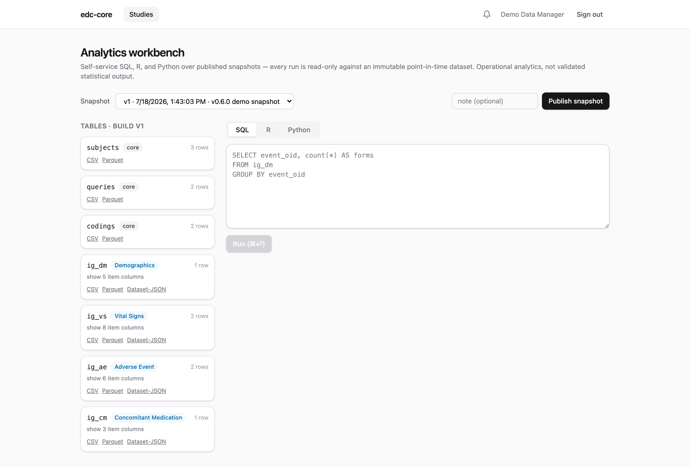

Sooner or later the data has to leave: to biostatistics, to a submission,
to a sponsor handover, to a records room that will outlive every vendor
contract. edc-core's exit paths are deliberately boring: open formats,
pinned to immutable snapshots, downloadable by anyone with the right
permission. This page covers the four of them: table exports, subject
casebooks, the study archive, and automatic eTMF filing.

**Who does this:** snapshot publication, exports, casebooks, and archives
require the `export.data` permission (`demo-dm` or `demo-admin` in the
demo).

## Snapshots are the export boundary

Everything exports from a [snapshot](analytics.qmd#snapshots), never from
live capture tables. That is what makes an export defensible: a snapshot
is an immutable, point-in-time dataset, so the file you sent to
biostatistics in March re-reads identically in November, no matter how
much capture happened in between. If you need fresher data, publish a
fresh snapshot; the old one stays.

## Table exports

On the [workbench](analytics.qmd), every snapshot table card offers its
download links:

{.screenshot fig-alt="Workbench table cards with per-table CSV, Parquet, and Dataset-JSON export links against a pinned snapshot"}

Three formats, three audiences:

- **Dataset-JSON v1.1**: the CDISC exchange standard accepted by FDA. Use
  it for anything regulatory-facing or moving between clinical systems;
  it carries dataset and variable metadata, not just values.
- **CSV**: for humans and spreadsheets. No metadata, universally
  readable.
- **Parquet**: for analysts. Typed, compressed, and loads directly into
  R, Python, or any modern analytics tool without parsing ambiguity.

Tables are one per ODM item group (`ig_vs`, `ig_ae`, …) plus `subjects`,
`queries`, and `codings`, with repeating groups carried as
`item_group_repeat_key`. [Blinded items](blinding.qmd) are absent from
snapshots by construction, so every export is blinded without anyone
remembering to mask a column.

## The subject casebook

Every subject has a **PDF casebook**: a human-readable rendering of all
their captured forms with current values, correction markers (version and
reason for change), per-occurrence repeating groups, query threads, and
the signature manifest. Blinded values print as `[BLINDED]` unless the
requester can unblind.

Download it from the subject's row on the matrix, or
`GET /subjects/:id/casebook`. Casebooks answer the person-level question
("show me everything for subject DEMO-001, as a document") the way table
exports answer the variable-level one, and one is generated per subject
in every study archive.

## The study archive

The archive is the whole study as one self-contained zip, built to
outlive the running system:

- the ODM study definition (XML and JSON) for **every** build version;
- all snapshot datasets, as Dataset-JSON and CSV;
- the complete audit trail as CSV;
- the signature manifest;
- a PDF casebook per subject;
- `MANIFEST.json`, identifying the exact snapshot version archived.

Everything inside is an open format readable without edc-core, which is
the point: retention obligations run long after any system is
decommissioned. Retrieval and retention duties under ICH E6(R3) §4.2.7,
and what remains procedural (the retention period itself, storage
location, periodic retrieval checks), are covered in the
[data lifecycle](../data-lifecycle.qmd) page.

For CRO and sponsor leadership evaluating exit risk: this archive *is*
the exit path. A study can be handed to a sponsor, a successor CRO, or a
records archive as one bundle, with no residual dependency on the running
deployment or on anyone's goodwill.

## Automatic eTMF filing

Deployments connected to an eTMF (the reference integration targets
[ctms-core](https://github.com/tgerke/ctms-core), edc-core's sibling on
the regulatory-document side) file study-level artifacts automatically:

- importing a study build files the blank CRF, as ODM XML;
- publishing a snapshot files the snapshot manifest.

The boundary is deliberate: only study-level documents. Subject-level
clinical data (casebooks, captured values) never leaves through this
path; the eTMF holds documents *about* the trial while the EDC remains
the system of record for data *in* the trial. Filing is best-effort and
asynchronous: the triggering operation never waits on the eTMF or fails
because of it, and each filed document lands in the eTMF as pending
review with provenance naming the build or snapshot it came from.
Configuration lives in
[docs/etmf-filing.md](https://github.com/tgerke/edc-core/blob/main/docs/etmf-filing.md).

## Permissions

`export.data` gates snapshot publication, table exports, casebooks, and
archives. `analytics.run` gates the workbench itself, so an organization
can let someone query without letting them take data out, or vice versa.
Like all grants, both are per-study and audited.

## Where next

- [Analytics workbench](analytics.qmd): querying snapshots before
  exporting them.
- [Blinding](blinding.qmd): why exports can't leak blinded values.
- [Data lifecycle](../data-lifecycle.qmd): retention, destruction, and
  the procedural side.
