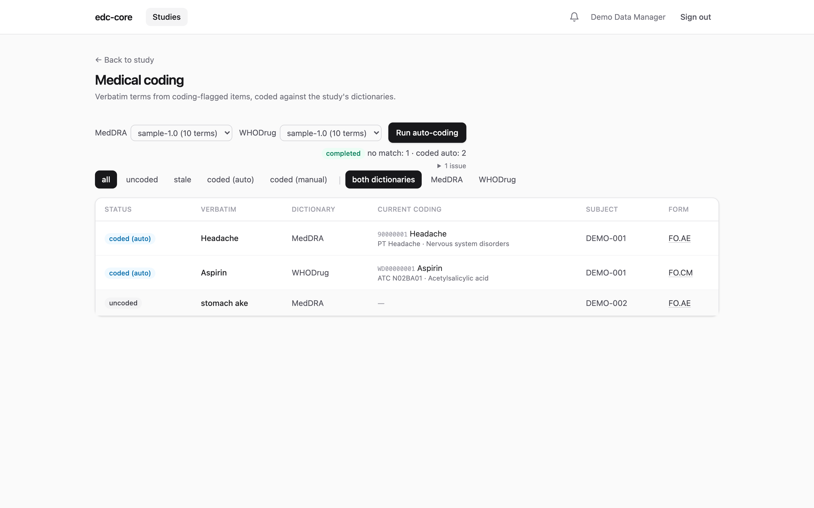

Sites report adverse events and medications in their own words —
"stomach ake", "asprin 81mg". Analysis needs standardized terms:
regulatory datasets pair each verbatim with its dictionary-derived
equivalent (in SDTM, `AETERM` codes to `AEDECOD`, the MedDRA Preferred
Term, with `AELLT`/`AEBODSYS`/`AESOC` carrying the rest of the
hierarchy; `CMTRT` codes to `CMDECOD`, the generic drug name in
WHODrug, with ATC classes in `CMCLAS`). Sites are not expected to be
coding experts — coding is a data-management activity that happens
after entry, and edc-core gives it its own audited workflow.

## Dictionaries are licensed — bring your own

MedDRA is licensed by the MSSO and WHODrug by the Uppsala Monitoring
Centre; edc-core ships **no dictionary content** and does not parse
their native distribution formats. Instead, convert your licensed
distribution once into a flat CSV (a simple join your distribution
tooling produces directly) and load it:

**MedDRA** — one row per Lowest Level Term, carrying its primary-SOC
hierarchy path:

```csv
llt_code,llt_term,pt_code,pt_term,hlt_code,hlt_term,hlgt_code,hlgt_term,soc_code,soc_term
```

**WHODrug** — one row per drug name; ATC columns may be empty:

```csv
code,name,atc_code,atc_text
```

Synthetic examples of both layouts live in
[`examples/dictionaries/`](https://github.com/tgerke/edc-core/tree/main/examples/dictionaries)
(made-up codes; not MedDRA or WHODrug content).

System administrators load dictionaries at **Studies → Dictionaries**
(up to 50 MB per upload) or with the CLI for very large files:

```sh
pnpm --filter @edc-core/api db:load-dictionary -- \
  --type MedDRA --version 27.1 --file meddra-27.1.csv
```

Loads are validated whole — a malformed row, empty required field, or
duplicate code rejects the file with its line number. A loaded
dictionary is immutable; a new release is a new upload with a new
version label. Dictionaries are global: load MedDRA 27.1 once and
every study can bind to it.

## Binding a study

On the study's **coding** page, anyone with `study.manage` binds the
study to one dictionary per type. Every coding stamps the dictionary
version it used, so rebinding mid-study never rewrites history — the
codings made against 27.0 still say 27.0. (Regulatory datasets expect
exactly that: the dictionary name and version used for coding is
declared in Define-XML.)

## Marking items for coding

The study build declares which items hold verbatim terms via the
`edc:CodingDictionary` attribute (or the **Coding** select in the
builder):

```xml
<ItemDef OID="IT.AE.AETERM" Name="Reported Term" DataType="text"
         edc:CodingDictionary="MedDRA"/>
<ItemDef OID="IT.CM.CMTRT" Name="Reported Medication Name" DataType="text"
         edc:CodingDictionary="WHODrug"/>
```

Like blinding, the flag is protocol metadata and versions with the
build. Blinded items are never codable — coding surfaces show
verbatims to every coder, which would bypass blinding — and the build
importer warns if an item is flagged both ways.

## The coding workflow

Coding needs the `data.code` permission (data managers and admins by
default; grant it to a dedicated coder role via role management).
Codings live in their own append-only table beside the clinical
record, **not** in the form data:

- **Coding never touches the form.** A completed, signed, or locked
  form is codable without reopening it, without invalidating
  signatures, and without an entry in the form's workflow history.
- **Corrections append.** Recoding or clearing writes the next
  version; the full history stays queryable and every action is in
  the audit trail (`coding.assigned`, `coding.cleared`) with old and
  new values.
- **Each coding stamps the verbatim it coded.** If a site later
  corrects the verbatim, the coding shows as **stale** on the coding
  page until a human confirms or recodes it.

{.screenshot fig-alt="Medical coding work queue with auto-coded terms and one uncoded verbatim"}

**Auto-coding** handles the bulk: one click starts a background run
that assigns every uncoded verbatim exactly matching a dictionary term
(case- and whitespace-insensitive; MedDRA matches LLT terms, WHODrug
matches drug names). Everything else is reported — no match, ambiguous
match, no dictionary bound — and the run never touches already-coded
or stale occurrences. Auto-codings are audited with `origin: auto` and
the run id, and can be overridden manually at any time.

**Manual coding** is the search-and-assign panel on each row of the
coding page: search the bound dictionary (substring match, exact
matches first), review the hierarchy path or ATC class, and assign.

## Analytics

Every snapshot publish includes a `codings` lake table — the latest
coding per occurrence with its full stamped path — joinable to any
dataset on the occurrence keys:

```sql
SELECT ae.subject_key, ae.it_ae_aeterm, c.pt_term, c.soc_term
FROM lake.ig_ae ae
LEFT JOIN lake.codings c
  ON c.subject_key = ae.subject_key AND c.event_oid = ae.event_oid
 AND c.item_group_repeat_key = ae.item_group_repeat_key
 AND c.item_oid = 'IT.AE.AETERM'
```

One conformance note: regulatory submissions expect coded terms to
match the dictionary's exact case and spelling. edc-core stores the
dictionary term verbatim from your converted CSV, so that property is
inherited from your conversion — convert faithfully.

## Current limitations

- No coding queries: a coder needing site clarification opens an
  ordinary manual query (requires `query.manage`).
- No coder/reviewer approval step; a coding is effective when
  assigned.
- Exact-match auto-coding only — no synonym lists or wildcard rules.
- No SMQ (Standardised MedDRA Queries) support.
- One coding per item occurrence; repeating item groups code each
  occurrence independently.
