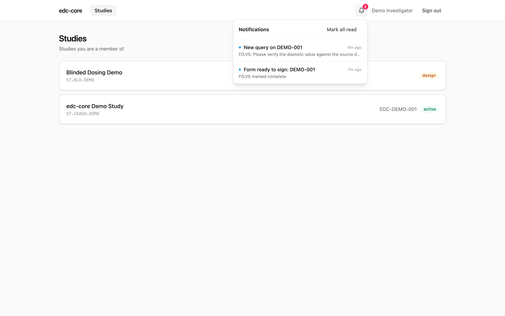

Query aging is mostly waiting: the site doesn't know a query was opened,
the reviewer doesn't know it was answered, the signer doesn't know the
form is ready. edc-core closes those gaps with an in-app inbox (the bell
in the header) and optional email delivery, without asking anyone to poll
dashboards.

**Who sees what:** notifications go to the people whose permissions let
them act on the event, scoped to the site where it happened. Nobody is
notified about their own action.

## The bell

The bell shows an unread count and opens an inbox; each entry deep-links
to the affected form or page, and can be marked read individually or all
at once. In the demo below, `demo-dm` has opened a manual query on
DEMO-001's vitals, and `demo-inv`, who can answer it, finds it waiting:

{.screenshot fig-alt="The notification inbox open from the header bell, showing a new-query notification with a deep link to the affected form"}

## What notifies whom

| Event | Who is notified |
|---|---|
| Manual query opened | Site staff who can answer it (`query.answer`, at that site) |
| Query answered | Reviewers who manage queries (`query.manage`) |
| Form reaches complete or verified | Its potential signers (`data.sign`) |
| Form overdue (optional, see below) | Site data-entry staff |
| Site layout gone stale after an amendment | The site and the sponsor |
| Security anomaly detected | System administrators |

: {tbl-colwidths="[45,55]"}

Two rules keep the volume honest. Notifications are never sent to the
person who caused the event. And **system queries from edit checks raise
no notifications at all**: they open and close with the data during entry,
and notifying anyone about self-resolving checks would train everyone to
ignore the bell.

## Following the demo example

Sign in as `demo-dm`, open DEMO-001's vitals form from the subject
matrix, and open a manual query on a value. Now sign in as `demo-inv`
(or `demo-coord`): the bell shows one unread, and the entry links
straight to the form with the query panel open. Answer it, switch back to
`demo-dm`, and the answer is in *their* inbox. That round trip, minus the
sign-ins, is the working loop between sites and reviewers.

## Email delivery

With SMTP configured
([installation](../installation.qmd#notifications-and-email)), each
notification is also sent by email with the same deep link, so site staff
who aren't logged in still hear about queries the day they're opened.
Without SMTP, the in-app inbox works on its own.

## Overdue-form reminders

A background scan can flag forms still not started or in progress too long
after their visit was created. It is **off by default** and deliberately
crude: visit windows are protocol modeling, not notifications.

```sh
EDC_FORM_OVERDUE_DAYS=14     # days before an unfinished form counts as overdue; 0 (default) = off
EDC_NOTIFY_SCAN_MINUTES=15   # scheduler tick; 0 disables the scheduler
```

Reminders deduplicate, so a form nags once, not every tick.

## Why this matters operationally

For clinical operations, the metric this machinery moves is **query aging**:
the time from query opened to answered to closed. Every hop in that cycle
that used to depend on someone remembering to check a dashboard is now a
push. The [analytics workbench](analytics.qmd) has the other half: the
`queries` table in every snapshot, where aging is one SQL query away.

## Where next

- [Review workflows](review.qmd): the query lifecycle these notifications
  serve.
- [Installation](../installation.qmd#notifications-and-email): SMTP setup.
- [User administration](user-admin.qmd#security-anomalies): the
  administrator-facing anomaly notifications.
