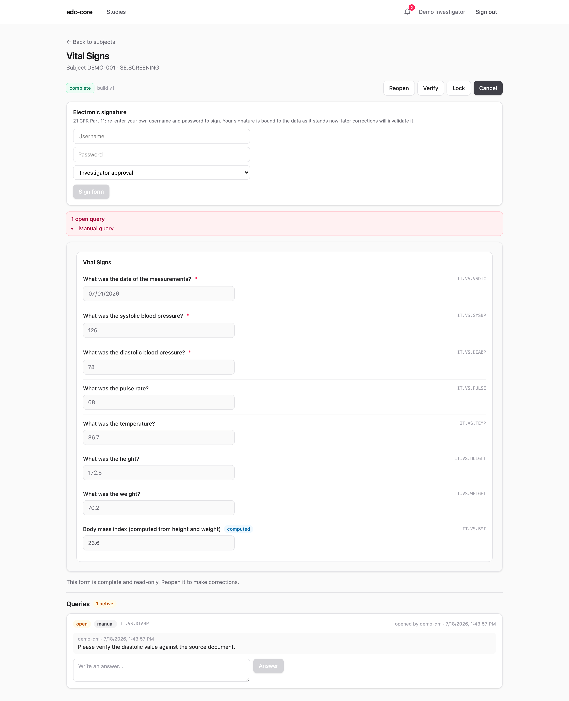

## Queries

Queries are threaded conversations attached to a form or a specific item.
They come from two places:

- **System queries:** raised automatically when a saved value fails an edit
  check; closed automatically when the data is corrected.
- **Manual queries:** opened by data managers or monitors against any form or
  item, answered by site staff, and closed (or reopened) by the reviewer.

Each study has a queries dashboard showing every query with status, origin,
subject, and the latest message:

{.screenshot fig-alt="Queries dashboard"}

The full lifecycle (`open → answered → closed`, with reopen) is audited, and
open queries are surfaced prominently on the affected form during entry.

## Notifications

The bell in the header keeps review work moving without polling dashboards:
opening a manual query notifies the site staff who can answer it, an answer
notifies the reviewers, and a form reaching complete or verified notifies
its potential signers, in-app and (with SMTP configured) by email. The full
event-to-recipient map, the overdue-reminder scan, and the deliberate
silences are on the [notifications page](notifications.qmd).

## Source data verification

Monitors mark completed forms **verified**, a distinct workflow state between
*complete* and *signed*, so SDV progress is visible directly in the subject
matrix.

## Electronic signatures (21 CFR Part 11)

Investigators sign completed forms. Signing requires **re-authenticating at
the moment of signature**, even mid-session: the signing panel states what
the signature means and that later corrections will invalidate it, and asks
the signer to prove their identity again before anything is recorded.

{.screenshot fig-alt="The electronic-signature panel on a completed form: a Part 11 statement, credential fields, and the signature meaning, shown before signing"}

How the re-authentication happens follows how the account signs in:

- **Password accounts** re-enter their own username and password.
- **SSO accounts** re-authenticate with the identity provider: the signing
  panel opens a fresh provider window, and the provider's confirmation
  returns as a one-time grant that authorizes exactly one signature.

The stored signature records:

- who signed, when, and the signature's meaning (e.g., investigator approval)
- a SHA-256 hash over the exact item-value versions signed, binding the
  signature to that specific content

If the form later becomes editable again, the signature is invalidated
one-way: the record of the original signature and its invalidation both remain
permanently in the audit trail.

## Audit trail review

Storing an audit trail is not enough: ICH E6(R3) expects it to be *reviewed*.
The audit page gives reviewers the study's complete trail, every create,
change, and state transition with actor, timestamp, before/after values, and
reason. Filter by action, entity, and user, or export the trail to CSV.

{.screenshot fig-alt="Audit trail with filters and CSV export"}

Under the hood, audit rows and item-value versions are append-only tables;
PostgreSQL triggers reject `UPDATE` and `DELETE` outright, and the tests prove
it. The trail is also included, in full, in every
[study archive](analytics.qmd#exports-and-the-study-archive).
