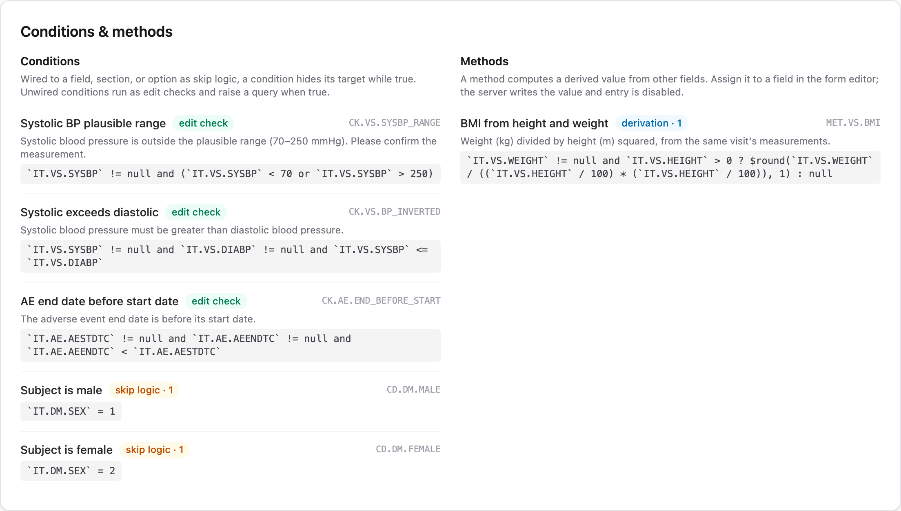
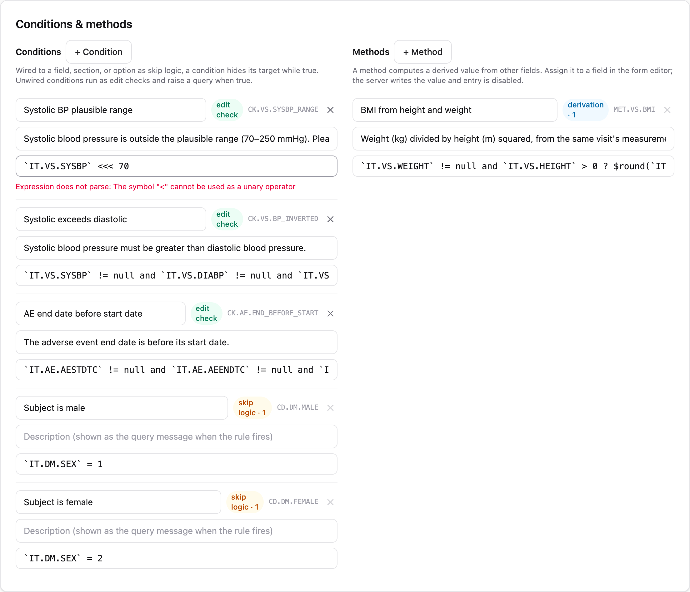

A study build can do three things with logic: flag implausible data (edit
checks), decide what gets collected (skip logic and dependent options), and
compute values instead of collecting them (derivations). All three are
authored the same way, in the **Conditions & methods** panel of the study
builder, as small [JSONata](https://jsonata.org) expressions stored inside
the ODM build. This page is the authoring guide; what these rules look like
during data entry is covered in
[Data capture](data-capture.qmd#conditional-and-computed-fields).

**Who does this:** anyone with the `study.manage` permission on the study
(`demo-admin` or `demo-dm` in the seeded demo). Follow along by opening the
demo study's latest build and clicking **Edit build**.

## Three jobs, one machinery

| You want to… | You author a… | It becomes, in ODM |
|---|---|---|
| Flag a suspect value and raise a query | Condition, left unwired | A `ConditionDef` the server evaluates on every save |
| Hide a field or section while something is true | Condition, wired to the field | A `CollectionExceptionConditionOID` on the `ItemRef` or `ItemGroupRef` |
| Withdraw one option from a choice list | Condition, wired to the option | The same attribute on a `CodeListItem` (vendor extension) |
| Compute a value from other answers | Method, assigned to a field | A `MethodDef` referenced by the item's `MethodOID` |

: {tbl-colwidths="[34,26,40]"}

The role follows from the wiring, and the builder shows it as a badge on
each rule: an unwired condition is labeled **edit check**, a wired one
**skip logic** with its reference count, and every method **derivation**.
Wiring a condition to a field changes what it does, not just where it
appears: skip logic gates collection and never raises queries, while an
edit check flags data and never hides anything.

{.screenshot fig-alt="The Conditions & methods panel on the builder page, listing the demo study's edit checks, skip conditions, and BMI derivation with role badges"}

## JSONata in ten minutes

JSONata expressions read item values by their OIDs in backticks and combine
them with ordinary operators. Everything you need for most studies fits in a
few patterns, all taken from the demo study:

**A range check** (`CK.VS.SYSBP_RANGE`). True when the value is
implausible; the description becomes the query text.

```
`IT.VS.SYSBP` != null and (`IT.VS.SYSBP` < 70 or `IT.VS.SYSBP` > 250)
```

**A cross-field check** (`CK.VS.BP_INVERTED`). Two fields that must agree:

```
`IT.VS.SYSBP` != null and `IT.VS.DIABP` != null and `IT.VS.SYSBP` <= `IT.VS.DIABP`
```

**A date-ordering check** (`CK.AE.END_BEFORE_START`). ISO dates compare
correctly as strings:

```
`IT.AE.AESTDTC` != null and `IT.AE.AEENDTC` != null and `IT.AE.AEENDTC` < `IT.AE.AESTDTC`
```

**A cross-form check** (`CK.AE.ONSET_BEFORE_CONSENT`). Qualifying an item
with another form's OID reads that form of the same subject. The query
opens on the form the unqualified items belong to (here, the AE form), and
because the other form's data isn't available in the browser, these checks
run only on the server — the entry UI marks their findings *checked on
save*:

```
`IT.AE.AESTDTC` != null and `FO.DM`.`IT.DM.RFICDTC` != null
  and `IT.AE.AESTDTC` < `FO.DM`.`IT.DM.RFICDTC`
```

**A skip condition** (`CD.DM.MALE`). True when the field should *not* be
collected. The demo study skips the pregnancy-test item while sex is
recorded male (coded value 1):

```
`IT.DM.SEX` = 1
```

**A derivation** (`MET.VS.BMI`). Returns the computed value, or null when
inputs are missing (the field stays empty rather than erroring):

```
`IT.VS.WEIGHT` != null and `IT.VS.HEIGHT` > 0
  ? $round(`IT.VS.WEIGHT` / ((`IT.VS.HEIGHT` / 100) * (`IT.VS.HEIGHT` / 100)), 1)
  : null
```

Three habits keep rules trustworthy. Guard against nulls: an untouched form
has every value null, and a check that fires on empty forms buries sites in
queries. Lean on the item's data type: values are evaluated as their ODM
type, so integers compare numerically and dates as ISO strings. And keep
expressions pure: they read the form's values and return a result; they
cannot write or fetch. The one sanctioned way to see beyond the form is a
[cross-form check](#cross-form-checks), covered below.

## Walkthrough: author an edit check

As `demo-admin`, open the demo study, open the latest build, and click
**Edit build**. Scroll to **Conditions & methods**.

1. Click **+ Condition**. A new rule appears with a generated OID.
2. Name it (say, "Pulse plausible range") and write the description sites
   will read when it fires: this text *is* the query message.
3. Type the expression. The panel checks syntax as you type; a typo shows
   **Expression does not parse** with the parser's reason, immediately and
   before anything is saved:

{.screenshot fig-alt="Editing a condition expression in the builder, with the live syntax checker reporting that the expression does not parse"}

4. Leave it unwired: an unreferenced condition runs as an edit check.
5. Click **Save as new build**. The draft is validated whole and written as
   the next immutable build version, through the same import path as an ODM
   file.

Nothing you type is persisted until that save, so experimenting is free.
Existing forms keep the build they were captured under; moving them to the
new build is an explicit [amendment migration](amendments.qmd).

## Walkthrough: skip logic and dependent options

Skip logic is a condition plus a reference. In the demo study, the condition
`CD.DM.MALE` (true while sex is male) exists in the rules panel, and the
pregnancy-test item's editor wires it as the item's collection exception.
To do the same for any field: author the condition, then open the item in
the form editor and select it under the skip setting.

Two things follow from the wiring:

- The field disappears during entry while the condition is true, and
  returns when it goes false. A section whose every field is skipped hides
  entirely.
- A value that was already saved is never silently deleted when its field
  becomes skipped; it is retained, badged **not collected**, and queried
  until the site resolves it. The entry-side behavior, including the
  retained-value workflow, is described in
  [Data capture](data-capture.qmd#conditional-and-computed-fields).

The same mechanism, referenced from a codelist option instead of a field,
withdraws that one option while the condition is true: the demo study
removes "Not performed" from the pregnancy-test result once sex is recorded
female. In the export this uses the `edc:` vendor-extension attribute, so
consumers that only speak plain ODM simply see the full option list.

## Walkthrough: a derived value

Methods live in the right column of the same panel. The demo study's
`MET.VS.BMI` computes BMI from height and weight:

1. Click **+ Method**, name it, and write the expression.
2. Open the target item in the form editor and assign the method. The item
   becomes computed: entry is disabled everywhere, including lab import and
   RTSM intake.
3. Save as a new build.

At runtime the server evaluates the method after every accepted write and
stores the result through the normal audited path, as `item_value.derived`,
permanently distinguishable from entered data. Sites see a live preview
with a **computed** badge while they type the inputs, but the stored value
is always the server's own calculation. A derivation may read other derived
items; a circular chain is rejected when the build is validated, not
discovered at runtime.

## Cross-form checks

Everything above reads one form instance at a time. Consistency checks
often need two: an adverse event's onset against the screening visit date,
a concomitant medication against the AE it treats. An edit check reads the
subject's other forms by qualifying item OIDs with the form's OID:

```
`IT.AESTDT` != null and `IT.AESTDT` < `FO.DM`.`IT.VISDT`
```

Unqualified OIDs keep their meaning, the form the check is evaluated on, so
every existing check behaves exactly as before. The form holding the
check's unqualified items is its **home form**: the form where its queries
open and where sites see the finding. This check's home is the AE form; it
fires there when an onset date precedes the Demographics visit date.

**What a reference sees.** A qualified form OID binds to an array of the
subject's instances of that form, one object per instance. Each object
carries the form's item values, typed the same way as local values, plus
three metadata keys: `_event_oid`, `_event_repeat_key`, and
`_form_repeat_key`. A repeating item group inside the form appears as an
array of occurrence objects, each holding `_repeat_key` and that
occurrence's values. JSONata's sequence semantics fit this shape: with a
single Demographics instance, `` `FO.DM`.`IT.VISDT` `` is simply the date,
and against a repeating form or event it is a sequence you can filter. The
metadata keys are how you pin a reference to one visit:

```
`IT.AESTDT` != null
  and `IT.AESTDT` < `FO.DM`[`_event_oid` = "SE.SCR"].`IT.VISDT`
```

A referenced form the subject does not have yet contributes nothing: the
qualified reference evaluates to nothing, comparisons against it are not
true, and the check stays quiet, the same behavior as the null guards you
already write locally.

**When it fires.** The server re-evaluates a cross-form check after every
accepted write to *any* form its expression reads, not just the home form.
Correcting the Demographics visit date re-runs the AE check and opens or
auto-closes its system queries on the AE form, with the same
open-and-auto-close mechanics as any edit check. One edge case: if the home
form has no instance yet (the site has not opened it), there is nothing to
attach a query to, so the check first fires on that form's own first write.

**During entry.** Single-form rules give feedback as the site types.
Cross-form checks are the exception: the browser is never sent the
subject's other forms (both payload size and blinding forbid it), so they
cannot fire instantly. Their findings arrive with the save response and
render with a **checked on save** label. Builds that use no cross-form
checks are unaffected, during entry and everywhere else.

**Validation at publish.** Saving a build checks every qualified reference:
naming an item that is not on the referenced form is an error, and a
cross-form check with no unqualified local item at all is a warning: it
would evaluate identically on every form, leaving no home form to attribute
its query to.

**Scope.** Only edit checks cross forms. Skip logic and derivations stay
single-form: qualified references are not honored in a collection-exception
condition or a MethodDef.

## How rules travel

Conditions and methods are part of the build, so they export and import
with it. In the ODM XML they are ordinary `ConditionDef` and `MethodDef`
elements with JSONata formal expressions:

```xml
<ConditionDef OID="CK.VS.SYSBP_RANGE" Name="Systolic BP plausible range">
  <Description>
    <TranslatedText xml:lang="en" Type="text/plain">Systolic blood pressure
    outside plausible range (70-250 mmHg)</TranslatedText>
  </Description>
  <FormalExpression Context="jsonata">...</FormalExpression>
</ConditionDef>
```

That means rules can be authored in the panel, in a file, by your protocol
tooling, or by an LLM, and land in the same versioned build either way.
Round-tripping is a tested property; option-level skip references use the
`edc:` namespace and are ignored gracefully by other ODM consumers.

## Pitfalls

- **Check messages are visible to everyone who sees the form.** Edit checks
  may reference [blinded items](blinding.qmd), but the description text is
  shown to blinded roles too; never word a message so it reveals the value.
  The importer warns when a check references a blinded item.
- **A wired condition never raises queries.** If you want both behaviors
  (skip a field *and* query an inconsistency), author two conditions.
- **Item definitions are shared.** Assigning a method or skip condition to
  an item affects every form that references that item.
- **Rules version with the build.** Tightening a check mid-study is an
  amendment; when migrated forms re-run the new check, expect new system
  queries where it fires. The [amendments page](amendments.qmd) shows how
  to preview that before executing.

## Where next

- [Data capture](data-capture.qmd#conditional-and-computed-fields): what
  sites see when these rules run.
- [Amendments](amendments.qmd): changing rules on a study that already has
  data.
- [Study builds](study-builds.qmd): the build model these rules live in.
