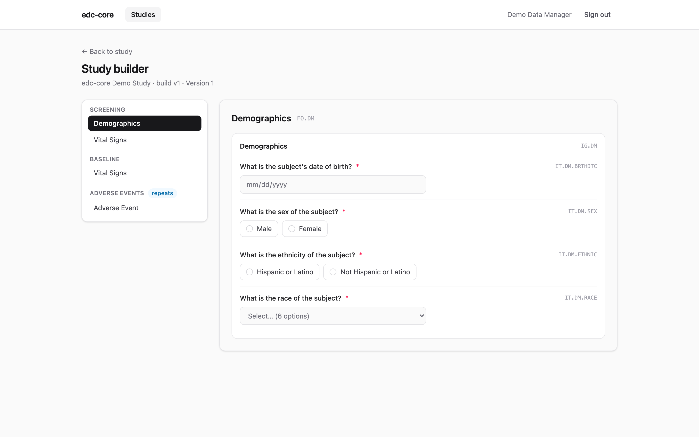
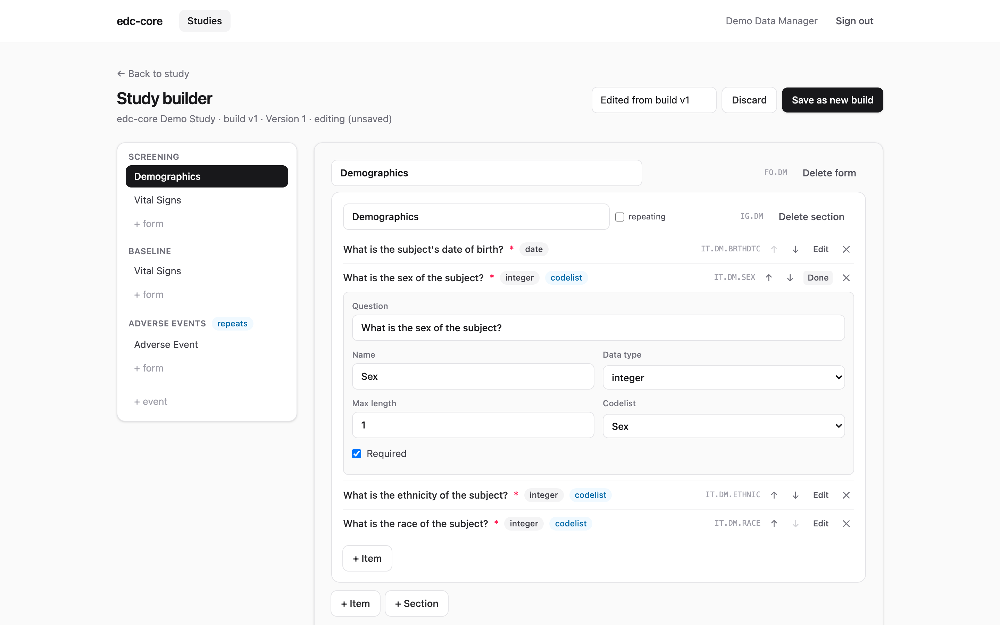

A *study build* is a versioned, immutable snapshot of your study definition —
events, forms, item groups, items, codelists, and edit checks — shaped as
CDISC ODM v2.0. Everything else in edc-core renders from it: CRFs, the subject
matrix, edit-check evaluation, and the analytics dataset layout.

## Three ways to build, one API

**Import an ODM file.** Open a study and click **Import ODM** (or `POST` the
document to `/studies/:id/study-builds`). Both the XML and JSON serializations
of ODM v2.0 are accepted and validated. The repository ships a complete
CDASH-aligned example in
[`examples/demo-study.xml`](https://github.com/tgerke/edc-core/blob/main/examples/demo-study.xml).

Legacy **ODM 1.3.x** metadata imports through a built-in upconversion shim:
`FormDef`s become `ItemGroupDef Type="Form"`, `GlobalVariables` become study
attributes, and the protocol's event ordering is preserved. Constructs the
v2.0 build model doesn't carry (measurement units, `RangeCheck`s, archive
layouts, embedded clinical data) are dropped **with an explicit warning for
each** — review the import warnings before using a converted build.

{.screenshot}

**Use the visual builder.** Every build can be opened in the study builder — a
tree of events and forms with a live, interactive preview of each CRF exactly
as data entry will render it.

{.screenshot fig-alt="Study builder with event/form tree and live form preview"}

With the `study.manage` permission, **Edit build** switches the builder into a
point-and-click editor: rename forms and sections, add or delete events, forms,
sections, and items, reorder items, change questions, data types, and lengths,
assign codelists, and toggle required/repeating flags. Nothing is persisted
while you work — **Save as new build** validates the draft and writes it
through the same import path as a file, creating the next immutable version.
A study with no builds yet offers a **start from scratch** shortcut that
creates a minimal first build to edit. (Item definitions are shared: editing a
question changes every form that references that item.)

{.screenshot fig-alt="Study builder in edit mode with an expanded item editor"}

**Script it.** Because file-driven and point-and-click builds hit the same
versioned-metadata API, builds are automatable: generate ODM from your
protocol tooling, from code, or with an LLM, and import the result. There is
no second, weaker representation to keep in sync.

## Versioning

Builds are numbered `v1, v2, …` and never modified in place (append-only,
enforced by a database trigger). Each form instance records the build version
it was captured under, so mid-study amendments don't disturb already-collected
data. Every build can be exported back out as ODM XML or JSON at any time —
round-tripping is a tested property.

## Mid-study amendments

When a protocol amendment lands mid-study, import (or build) the new version,
then use the **Amendments** panel on the study page:

1. **Diff** — compare any two builds: items added/removed/changed (data type,
   codelist, length, mandatory), edit checks, events, forms, and codelists.
2. **Analyze impact** — how many in-flight forms would migrate (by status and
   by current build), values orphaned by removed items, values that will not
   cast to a changed data type, and which checks will re-run.
3. **Execute** — each eligible form is re-pointed to the new build and its
   edit checks re-run, one transaction per form: newly firing checks open
   system queries, checks that no longer exist auto-close theirs, and every
   re-point is audited (`form.migrated`).

Two rules are deliberate:

- **Signed and locked forms never migrate.** Their signature hashes bind to
  the build they were signed under; re-signing after an amendment is an
  explicit, separate act.
- **Orphaned values are never deleted.** A value captured against an item the
  amendment removed stays in the append-only history and the audit trail — it
  just stops rendering and stops appearing in analytics snapshots.

Executing again after a partial run is safe: already-migrated forms are no
longer eligible.

## Edit checks

Edit checks are ODM `ConditionDef`s with JSONata formal expressions — pure,
side-effect-free expressions over the form's item values. The demo study
includes three:

- systolic blood pressure outside a plausible range (70–250 mmHg)
- diastolic ≥ systolic (inverted readings)
- adverse event end date before start date

A failing check warns instantly during entry and, on save, raises a **system
query** attached to the item. When the data is corrected, the query closes
automatically. See [Data capture](data-capture.qmd).
