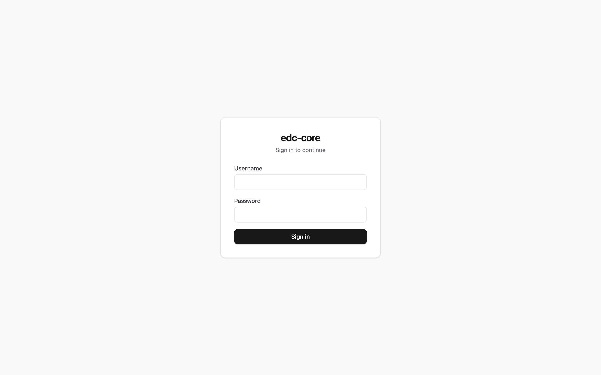

edc-core ships as a small set of containers: a PostgreSQL system of record, a
Node/TypeScript API, a browser SPA, and sandboxed R and Python engines. One compose file
brings up the whole stack; rootless Podman is the recommended path, and Docker
works identically.

## Requirements

- **Podman** (or Docker) with the compose plugin
- **Node ≥ 22** and **pnpm ≥ 9** — for the one-time setup scripts and local development
- ~2 GB free disk for images and volumes

## Quick start

```sh
git clone https://github.com/tgerke/edc-core
cd edc-core
pnpm install

# Postgres + API + web + R and Python engines
podman compose -f infra/compose.yaml up --build
```

The API applies database migrations automatically on startup. When the stack
is up:

- **Web UI** — <http://localhost:5173>
- **API** — <http://localhost:3000/health>

### Create the first admin

```sh
pnpm --filter @edc-core/api db:bootstrap-admin
```

This creates a root administrator account and prints its generated
credentials. Sign in with them at <http://localhost:5173>.

{.screenshot fig-alt="The edc-core sign-in screen"}

### Seed the demo study (optional, recommended)

```sh
pnpm --filter @edc-core/api db:seed-demo
```

This creates a complete, CDASH-aligned demo study (`ST.CDASH.DEMO`) with two
sites, one user per clinical role, enrolled subjects, and an open data query —
everything the [five-minute tour](tour.qmd) uses. The script prints the shared
demo password (override it with the `EDC_DEMO_PASSWORD` environment variable)
and is idempotent: it exits without changes if the demo study already exists.

## Single sign-on (OIDC)

edc-core signs users in with a local username and password by default, and can
additionally (or exclusively) use your organization's identity provider via
OpenID Connect — Microsoft Entra ID, Okta, and Keycloak all work with the
standard authorization-code flow. Configure it with environment variables on
the API container:

| Variable | Meaning |
|---|---|
| `EDC_OIDC_ISSUER_URL` | The provider's issuer URL. Setting this enables SSO. |
| `EDC_OIDC_CLIENT_ID` / `EDC_OIDC_CLIENT_SECRET` | The registered client. |
| `EDC_OIDC_REDIRECT_URI` | Must match the registration, e.g. `https://edc.example.org/api/auth/oidc/callback`. |
| `EDC_OIDC_SCOPES` | Default `openid profile email`. |
| `EDC_OIDC_PROVIDER_LABEL` | Button label on the sign-in page, e.g. `MSK SSO`. |
| `EDC_OIDC_ONLY` | Set to `1` to disable password login entirely. |
| `EDC_OIDC_REAUTH_MAX_AGE_SECONDS` | Freshness window for signature re-authentication (default 120). |

First-time SSO users are provisioned automatically — matched to an existing
account by verified email when one exists, created otherwise — but arrive with
**no study roles**: an administrator grants those in the app, exactly as for
local accounts. SSO accounts never receive system administration from the
identity provider.

Part 11 e-signatures re-execute authentication at signing. Password users
re-enter their credentials; SSO users complete a fresh interactive login with
the identity provider (`prompt=login`), verified against the token's
`auth_time`.

If `EDC_OIDC_ONLY` is set and the identity provider is misconfigured, recovery
is to unset the variable and restart the API — password login resumes.

## Notifications and email

Query activity and forms awaiting signature raise **in-app notifications**
(the bell in the header) out of the box. Two optional extras are env-driven
on the API container:

| Variable | Meaning |
|---|---|
| `EDC_NOTIFY_SCAN_MINUTES` | Minutes between background scans (default 15; `0` disables the scheduler). |
| `EDC_FORM_OVERDUE_DAYS` | Days after a visit is created before an unfinished form counts as overdue (default `0` = off). A deliberately crude signal — enable it once the cadence suits your protocol. |
| `EDC_SMTP_HOST` / `EDC_SMTP_PORT` / `EDC_SMTP_SECURE` | SMTP relay; setting the host enables email delivery of notifications. |
| `EDC_SMTP_USER` / `EDC_SMTP_PASS` | SMTP credentials, if the relay needs them. |
| `EDC_SMTP_FROM` | From address, e.g. `edc-core <no-reply@example.org>`. |
| `EDC_BASE_URL` | Web origin used in email deep links. |

The scheduler runs inside the API process and assumes the single-instance
deployment the compose file provides; email failures are retried a few times
and never block the in-app notification.

## Published images

Tagged releases publish versioned images to GitHub Container Registry:

```
ghcr.io/tgerke/edc-core-api
ghcr.io/tgerke/edc-core-web
ghcr.io/tgerke/edc-core-r-engine
ghcr.io/tgerke/edc-core-py-engine
```

Each release also attaches a **validation pack** — the regulatory traceability
matrix joined to that exact release's automated test results. See
[Compliance](compliance.qmd).

::: {.callout-warning}
## Before you deploy anywhere real

The compose file in `infra/` is a *local development* stack: it uses a
hard-coded database password and no TLS. Before any networked deployment,
work through the [deployment guide](deployment.qmd) — TLS, encryption at
rest, paired backups, log retention, and the GDPR/HIPAA hosting
considerations.
:::

## Local development

The repo is a pnpm monorepo. Useful commands from the repository root:

```sh
pnpm check              # biome lint + typecheck + all tests
pnpm --filter @edc-core/api dev    # API with hot reload on :3000
pnpm --filter @edc-core/web dev    # Vite dev server on :5173
pnpm validation-pack    # regenerate the validation pack locally
```

See [CONTRIBUTING.md](https://github.com/tgerke/edc-core/blob/main/CONTRIBUTING.md)
for ground rules — most importantly, every clinical-data write path goes
through the audit layer.
