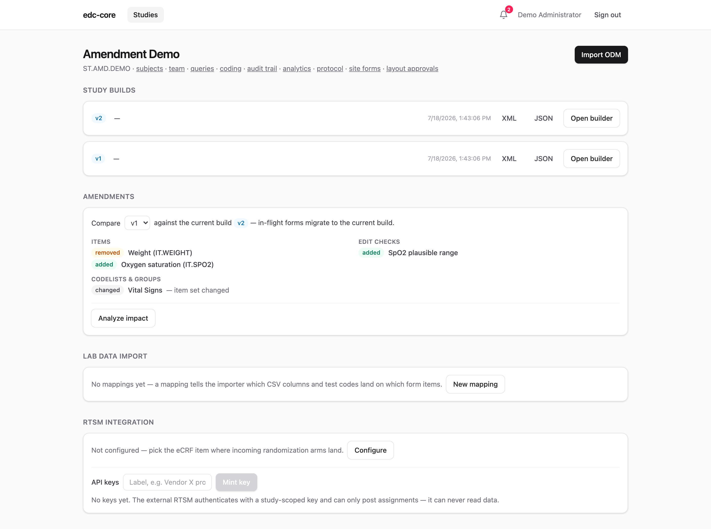
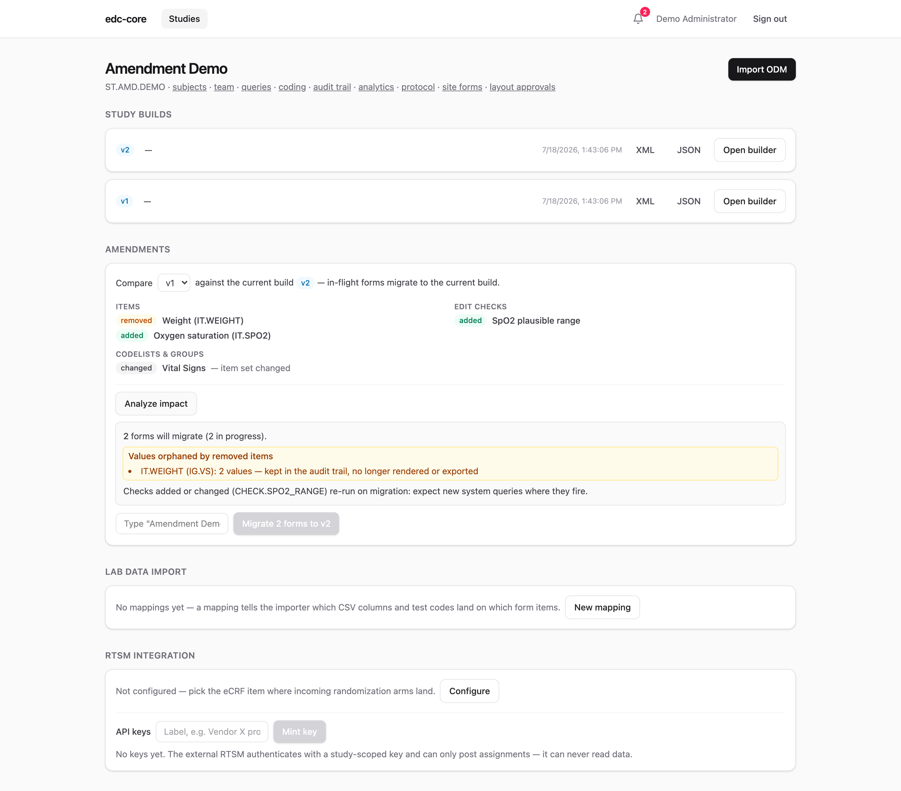

Protocols change after first patient in. In edc-core an amendment is not an
edit to the live study: it is a **new immutable build**, followed by an
explicit, previewable **migration** of in-flight forms. Nothing moves
automatically, nothing is overwritten, and every step leaves audit
evidence. This page walks the whole cycle on a worked example.

**Who does this:** amendment migration requires `study.manage`
(`demo-dm` or `demo-admin`). The screenshots use the seeded
`ST.AMD.DEMO` study, which ships with exactly the state described below.

## The worked example

The Amendment Demo study went live on build v1, collecting systolic and
diastolic blood pressure plus weight at Visit 1. Two subjects (AMD-001,
AMD-002) already have entered data. Then protocol amendment 1 lands:

- weight is dropped from Visit 1;
- oxygen saturation (SpO2) is added, with a plausible-range edit check.

Step zero is producing build v2, by any of the
[usual paths](/edc-core/guide/study-builds/): import the amended ODM file, edit v1 in
the visual builder and save, or re-import an amended
[protocol package](/edc-core/guide/protocol-import/). The moment a study has two or
more builds, an **Amendments** panel appears on its study page.

## Step 1: read the diff

The panel compares any earlier build against the latest, grouped by what
changed: items added, removed, or changed (data type, codelist, length,
mandatory flag), edit checks, events, forms, and codelists.

Read it the way a reviewer would: does the diff say exactly what the
protocol amendment says, and nothing else? A surprise entry here (a
renamed OID, an accidental type change) is far cheaper to catch now than
after migration. Unstable OIDs show up as remove-and-add pairs rather than
changes, which is why keeping identifiers stable across versions matters.

## Step 2: analyze the impact

**Analyze impact** answers "what would happen" without touching anything:

- how many in-flight forms are **eligible** to migrate, broken down by
  workflow status;
- how many **signed and locked forms are excluded**;
- values that would be **orphaned** by removed items (here: every entered
  weight), with counts;
- values that will **not cast** to a changed data type;
- which **checks will re-run** after migration.

This report is the amendment's data-management review in one screen. In
the demo: both subjects' forms are eligible, their weight values will be
orphaned (retained, not deleted), and the new SpO2 check will re-run on
migrated forms.

## Step 3: execute

Executing requires typing the study name to confirm, then re-points each
eligible form to the new build and re-runs its edit checks, **one
transaction per form**:

- checks that newly fire open system queries;
- checks that no longer exist auto-close theirs;
- every re-point writes a `form.migrated` audit event.

A partial run is safe to re-run: already-migrated forms are no longer
eligible, so execution is idempotent. New forms created after the
amendment simply start on the latest build.

## The two deliberate rules

**Signed and locked forms never migrate.** A signature's hash binds it to
the exact record versions *and build* it was signed under; silently moving
the form would make the signature attest to something the signer never
saw. Re-signing after an amendment is an explicit, separate act: reopen
the form (which invalidates the signature, visibly), migrate, and sign
again.

**Orphaned values are never deleted.** A value captured against an item
the amendment removed stays in the append-only history and the audit
trail; it stops rendering on the form and stops appearing in analytics
snapshots. If an auditor asks what happened to the weights collected
before amendment 1, the answer is a query away, not a shrug.

## Ripple effects

An amendment touches more than forms:

- **Site form layouts** are rechecked against the new build automatically:
  still-equivalent layouts carry forward with an audited note, while a
  layout the amendment broke goes **stale** and capture falls back to
  standard forms until the site resubmits. See
  [Site form layouts](/edc-core/guide/site-forms/#amendments).
- **Protocol-derived builds** amend by importing the amended protocol as a
  new protocol version and publishing the next build; the migration
  tooling from there is identical. See
  [Protocol import](/edc-core/guide/protocol-import/#amendments).
- **Analytics snapshots** are unaffected by design: each snapshot is
  pinned to the data and builds as they stood at publish time, so analyses
  against pre-amendment snapshots reproduce forever.
- **Lab-import mappings** that reference a removed item start failing
  loudly at validation, which is the intended signal to update the
  mapping. See [Lab data import](/edc-core/guide/lab-import/).

## What leadership should expect to see

For oversight purposes, one migration produces a coherent evidence trail:
the new build's import (who, when, with what warnings), the diff between
versions (reconstructable at any time, since builds are immutable), a
`form.migrated` audit event per moved form, the system queries the re-run
checks opened or closed, and untouched signed forms still bound to the
build they were signed under. An inspector's "how do you control mid-study
changes?" maps onto artifacts the system produced as a side effect of
doing the work.

## Where next

- [Study builds](/edc-core/guide/study-builds/): the versioning model amendments build
  on.
- [Rules and derivations](/edc-core/guide/rules-and-derivations/): what changing a
  check mid-study means.
- [Data capture](/edc-core/guide/data-capture/#workflow-states): the workflow states
  that decide migration eligibility.
