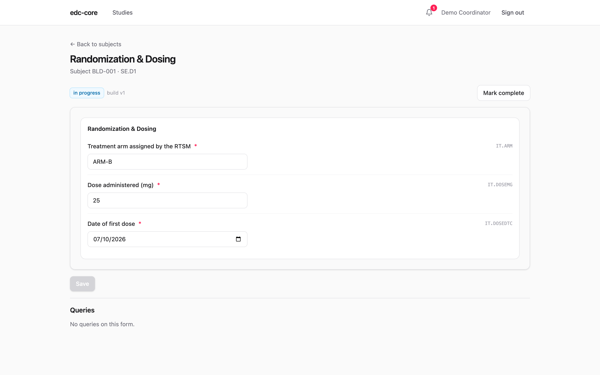
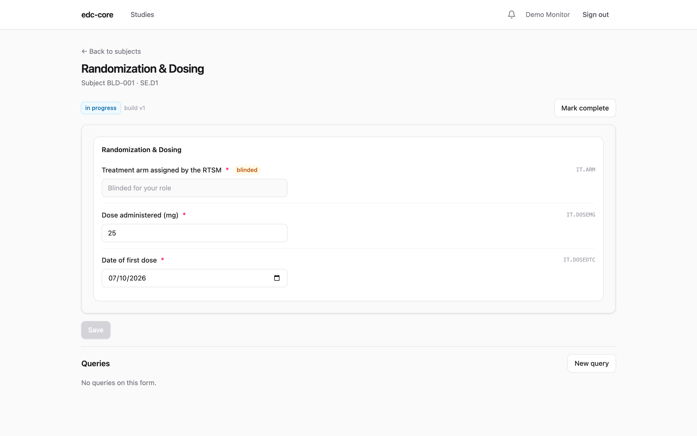
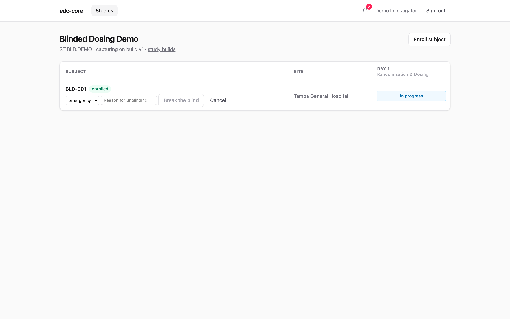

In a blinded trial, some values (most often the treatment arm) must be
invisible to some people while staying real, versioned, audited data. In
edc-core, blinding is a flag on the item definition, enforced everywhere
the value could appear, and governed by one permission. This page walks
what each role sees, where the mask follows the data, and how breaking the
blind is documented. The design rationale is
[ADR-0009](https://github.com/tgerke/edc-core/blob/main/docs/adr/0009-item-level-blinding.md).

**Who does what:** blinding is authored with `study.manage`; seeing
blinded values requires the `data.unblind` permission, held by default by
the site-facing roles (investigator, data entry, admin) and *not* by
monitors or data managers. The screenshots use the seeded
`ST.BLD.DEMO` study: a dosing form whose assigned-arm item is blinded,
entered by `demo-coord`, reviewed by `demo-cra` (monitor), with
`demo-inv` performing the break-the-blind action.

## The model in one paragraph

An item flagged **Blinded** (the checkbox in the builder's item editor, or
`edc:Blinded="Yes"` in the ODM file) is captured, versioned, and audited
exactly like any other item: blinding scopes *visibility*, not
collection. At read time, the server checks whether the requester holds
`data.unblind` in scope and masks the value if not. At snapshot publish,
blinded columns are excluded structurally, so downstream surfaces cannot
leak what they never contain.

## What each role sees

The demo study's Day 1 form collects the RTSM-assigned arm (blinded) and
the administered dose. The site coordinator, holding `data.unblind` as an
entry role, sees a normal form; entering a dose next to a visible arm
feels like entering anything else:

The monitor opens the same form and sees the item's presence and entry
status, but never its value:

That is the whole user-facing contract: the blinded reviewer can still
verify the form was filled, query it, and see *that* the arm changed in
the audit trail, without ever learning what it says.

## Everywhere the mask follows

The same rule applies wherever the value could travel:

- **Casebooks** print `[BLINDED]` unless the requester can unblind; study
  archives always use the blinded rendering.
- **Audit review** shows blinded reviewers who changed the item, when, and
  why, with old and new values masked.
- **Analytics snapshots never contain blinded columns at all**, so the
  SQL, R, and Python workbench and every export are blinded by
  construction; the snapshot manifest lists the excluded items.
- **The RTSM transfer log** masks the arm and strata for viewers without a
  study-wide `data.unblind` grant.

## Authoring blinded items

In the builder, tick **Blinded** on the item; in an ODM file, set
`edc:Blinded="Yes"` on the `ItemDef`. Two authoring rules interact with
other features:

- **Arm assignments from an RTSM should land on a blinded item.** The
  [RTSM integration](/edc-core/guide/rtsm-integration/) writes through a service
  account whose unblind grant is write-only in practice, so the arm is
  masked everywhere from the moment it arrives.
- **Blinded items are never codable**, and edit checks that reference
  blinded items must not reveal the value in their message text; the
  build importer warns about both. See
  [Rules and derivations](/edc-core/guide/rules-and-derivations/#pitfalls).

## Breaking the blind

Emergencies happen, and ICH E6(R3) expects each unblinding event to be
documented. In edc-core that is a first-class action on the subject
matrix: **Break the blind…** on the subject's status menu, taking a
category (planned, or unplanned: emergency, inadvertent, other) and a
required reason.

The action writes an append-only `subject.unblinded` audit event and marks
the subject with an **unblinded** badge, and the event prints in the
subject's casebook. Two boundaries are deliberate:

- **Breaking the blind is documentation, not a switch.** Masking stays
  governed by `data.unblind` grants; one subject's emergency unblinding
  must not unmask them for every viewer. Who needed to *see* the value
  gains the grant through the team page, auditable like any grant.
- **Emergency code-break workflows stay in the RTSM**, which holds the
  randomization list. edc-core records that an unblinding happened and
  why.

## Governance

Access to blinded data is a grant, not a setting. The
[team page](/edc-core/guide/user-admin/#study-teams) shows who holds `data.unblind`,
at what scope, granted when and by whom; revoking it takes effect
immediately. System administrators deliberately have no bypass: without a
study role carrying the permission, an administrator sees `[BLINDED]`
like any other viewer. For E6(R3) §4.1 purposes, the grant history is the
record of who could see unblinded data and when, and the break-the-blind
events are the record of each unblinding; assessing an unplanned
unblinding's impact on trial results remains your organization's call.

## Where next

- [RTSM integration](/edc-core/guide/rtsm-integration/): how the arm arrives without a
  human ever typing it.
- [Data capture](/edc-core/guide/data-capture/#blinded-items): the entry-side summary.
- [User administration](/edc-core/guide/user-admin/): granting and revoking
  `data.unblind`.
