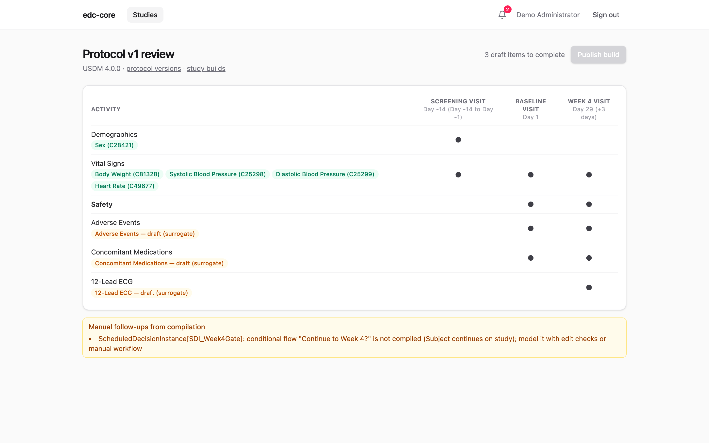

The protocol-first build path derives a study build from a CDISC **USDM v4**
protocol package instead of hand-built forms. If you are new to structured
protocols, read [Why protocol-first?](/edc-core/guide/why-protocol-first/) first; this page
is the how-to.

## What the importer accepts

A USDM v4 **JSON** package: the API "wrapper" format defined by the CDISC
DDF reference architecture, a top-level object with `usdmVersion` and a
`study` containing one `StudyVersion`, which holds the study design
(encounters, activities, schedule timeline) and the biomedical concepts. The
repository ships a complete worked example in
[`examples/demo-protocol-usdm.json`](https://github.com/tgerke/edc-core/blob/main/examples/demo-protocol-usdm.json).

On upload, edc-core:

1. validates the package (shape, cross-references, one main timeline);
2. stores it as an immutable **protocol version** (append-only, like study
   builds);
3. compiles a **candidate build**: encounters → events, scheduled activities
   → forms, biomedical concepts → items and codelists;
4. opens the **review screen**: the protocol's schedule of activities with a
   resolution status for every concept.

Nothing is published yet at this point. The candidate is a workspace.

## The review screen

Columns are the protocol's encounters (with planned timing and visit windows
straight from the protocol); rows are its activities. Each activity lists its
biomedical concepts:

- **Green (resolved)**: the concept mapped to concrete collection items
  (variables, datatypes, codelists), constrained by what the protocol enables
  and requires.
- **Amber (draft)**: the protocol names the concept without enough definition
  to build fields (a *surrogate* concept), or the bundled mapping doesn't
  carry it. Click the badge to complete it: name the item, set the question
  text, datatype, and optional codelist.



**Publish build** stays disabled until every draft is completed, so a
published build is always capture-ready. Publishing creates a normal study build (the
same versioned store as ODM imports and the visual builder), records
field-level traceability back to the protocol, and takes you to the builder,
where the build can be refined like any other: edit checks, blinding flags,
coding dictionaries, extra forms.

Compilation notes appear under the matrix. Review them: conditional
schedule logic (e.g. "continue to Week 4?" decision points) is not compiled
into forms and should be modeled with edit checks or workflow instead, and
activities with no data specification produce empty forms.

## Authoring USDM in Excel

Most teams won't hand-write USDM JSON. If you don't have a study design tool
that exports USDM, the practical route is CDISC's open **usdm4-excel**
converter: author the study design in a structured Excel workbook and convert
it to USDM JSON locally, then upload the JSON here.

```bash
pip install usdm4-excel
```

The workbook follows the template published with the
[cdisc-org/usdm](https://github.com/cdisc-org/usdm) project, with one sheet per
aspect of the design. In practice you will touch:

- **Study**: identifiers, titles, sponsor.
- **Timeline / SoA**: one row per scheduled step: the encounter (visit), its
  epoch, the activities performed, and the timing relative to an anchor
  (ISO 8601 durations, e.g. `P28D` for Day 29, with window bounds).
- **Activities**: the SoA row labels, with optional parent/child grouping
  for presentation.
- **Biomedical concepts**: per activity, the concepts collected. Use NCI
  c-codes (e.g. `C25298` for Systolic Blood Pressure) wherever you can:
  c-codes are how edc-core's bundled mapping recognizes a concept and builds
  its fields automatically. A concept you can only name (no code) imports as
  a surrogate and becomes a draft to complete in review.

Doing it properly, meaning the difference between a clean import and an
afternoon of warnings:

- **One StudyVersion, one StudyDesign, one main timeline.** The importer uses
  the first of each and warns on extras.
- **Every reference must resolve.** Activities referenced by schedule rows,
  concepts referenced by activities, timings anchored to real steps. Dangling
  references are rejected with the exact path.
- **Anchor your timing.** Pick one step (typically baseline/Day 1) as the
  fixed reference; give every encounter a timing so visit windows carry into
  the build.
- **Stable names.** Field identifiers derive from concept c-codes, synonyms,
  and names; keep them stable across protocol versions so amendments diff
  cleanly rather than appearing as remove-and-add.
- **Convert, inspect, upload.** Open the generated JSON once before
  uploading; the converter's sheet-level errors are easier to fix in the
  workbook than after import.

The import screen reports validation problems with the same paths used here
(e.g. `Activity[Activity_VitalSigns]: biomedicalConceptId → "BC_X" does not
resolve`), which map one-to-one onto workbook rows.

## Amendments

Import the amended protocol as a new protocol version: it compiles to a new
candidate, review works the same way, and publishing creates the next build
version. From there the standard [amendment tooling](/edc-core/guide/study-builds/)
applies: diff the builds, analyze the migration, and move in-flight
subjects.

## Traceability

For protocol-derived builds, every event, form, item, and codelist records
which protocol element it came from, visible in the ODM export as `edc:`
attributes and queryable via
`GET /studies/:id/metadata-versions/:version/traceability`. Auditors get a
direct answer to "where did this field come from," and data managers can ask
"which fields carry biomedical concept X" without opening the build.
