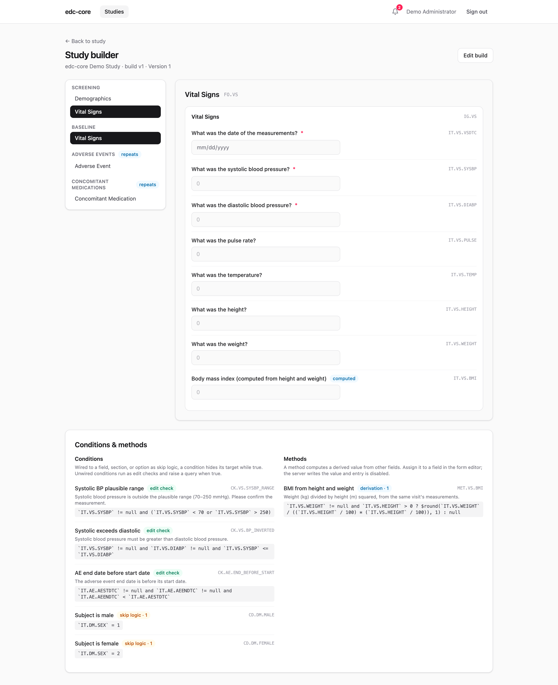
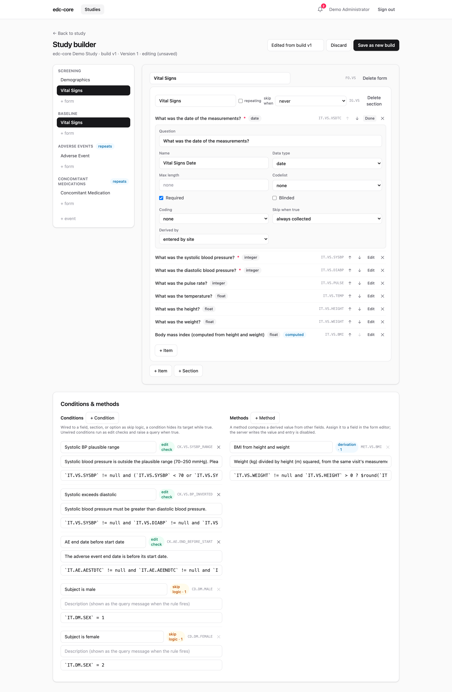

A *study build* is a versioned, immutable snapshot of your study definition
(events, forms, item groups, items, codelists, and edit checks), shaped as
CDISC ODM v2.0. Everything else in edc-core renders from it: CRFs, the subject
matrix, edit-check evaluation, and the analytics dataset layout.

## Three ways to build, one API

**Import an ODM file.** Open a study and click **Import ODM** (or `POST` the
document to `/studies/:id/study-builds`). Both the XML and JSON serializations
of ODM v2.0 are accepted and validated. The repository ships a complete
CDASH-aligned example in
[`examples/demo-study.xml`](https://github.com/tgerke/edc-core/blob/main/examples/demo-study.xml).

Legacy **ODM 1.3.x** metadata imports through a built-in upconversion shim:
`FormDef`s become `ItemGroupDef Type="Form"`, `GlobalVariables` become study
attributes, and the protocol's event ordering is preserved. Constructs the
v2.0 build model doesn't carry (measurement units, `RangeCheck`s, archive
layouts, embedded clinical data) are dropped **with an explicit warning for
each**. Review the import warnings before using a converted build.

**Use the visual builder.** Every build can be opened in the study builder: a
tree of events and forms with a live, interactive preview of each CRF exactly
as data entry will render it.

With the `study.manage` permission, **Edit build** switches the builder into a
point-and-click editor: rename forms and sections, add or delete events, forms,
sections, and items, reorder items, change questions, data types, and lengths,
assign codelists, toggle required/repeating flags, and wire skip conditions
and derivation methods to fields and sections. The **Conditions & methods**
panel below the form editor manages the rules themselves; JSONata expressions
are syntax-checked as you type, and
[Rules and derivations](/edc-core/guide/rules-and-derivations/) is the full authoring
guide. Nothing is persisted
while you work. **Save as new build** validates the draft and writes it
through the same import path as a file, creating the next immutable version.
A study with no builds yet offers a **start from scratch** shortcut that
creates a minimal first build to edit. (Item definitions are shared: editing a
question changes every form that references that item.)

**Script it.** Because file-driven and point-and-click builds hit the same
versioned-metadata API, builds are automatable: generate ODM from your
protocol tooling, from code, or with an LLM, and import the result. There is
no second, weaker representation to keep in sync.

## Versioning

Builds are numbered `v1, v2, …` and never modified in place (append-only,
enforced by a database trigger). Each form instance records the build version
it was captured under, so mid-study amendments don't disturb already-collected
data. Every build can be exported back out as ODM XML or JSON at any time;
round-tripping is a tested property.

## Mid-study amendments

When a protocol amendment lands mid-study, import (or build) the new version,
then use the **Amendments** panel on the study page: **diff** the builds,
**analyze the impact** on in-flight forms, and **execute** an audited
migration. Two rules are deliberate: signed and locked forms never migrate
(their signatures bind to the build they were signed under), and values
orphaned by removed items are never deleted. The full walkthrough, with the
impact report explained line by line, is on the
[amendments page](/edc-core/guide/amendments/).

## Edit checks

Edit checks are ODM `ConditionDef`s with JSONata formal expressions: pure,
side-effect-free expressions over the form's item values. The demo study
includes three:

- systolic blood pressure outside a plausible range (70–250 mmHg)
- diastolic ≥ systolic (inverted readings)
- adverse event end date before start date

A failing check warns instantly during entry and, on save, raises a **system
query** attached to the item. When the data is corrected, the query closes
automatically. See [Data capture](/edc-core/guide/data-capture/).

## Dynamic fields

Beyond checks that flag data, a build can make the form itself respond to the
data ([ADR-0014](https://github.com/tgerke/edc-core/blob/main/docs/adr/0014-conditional-collection-and-derived-values.md)).
All three constructs reuse the same JSONata `ConditionDef`/`MethodDef`
machinery as edit checks, so they travel inside the ODM build like everything
else.

**Skip logic.** A `CollectionExceptionConditionOID` on an `ItemRef` or
`ItemGroupRef` marks the field (or the whole section, including nested
sections) as *not collected* while the referenced condition is true. This is
standard ODM. The demo study skips its pregnancy-test item while the subject's
sex is recorded male.

**Dependent options.** The same attribute on a `CodeListItem` (as the
`edc:CollectionExceptionConditionOID` vendor extension) withdraws one option
from the choice list while its condition is true. The demo study withdraws
"Not performed" from the pregnancy-test result once the subject is recorded
female. Consumers that only speak plain ODM ignore the attribute and see the
full option list, so exports stay portable.

**Derived values.** An `ItemRef` with a `MethodOID` is computed, not entered:
the server evaluates the method's JSONata expression after every accepted
write and stores the result through the normal audited path (as
`item_value.derived`, permanently distinguishable from entered data). The
demo study computes BMI from height and weight. A derivation may read other
derived items; circular chains are rejected at validation time.

Conditions and methods referenced this way are collection logic, never edit
checks: they gate what is collected instead of raising queries. All of it can
be authored in the builder's rules panel and item editors, or imported inside
an ODM file; both land in the same build. What happens
at the point of entry — fields appearing and disappearing, retained values
that need clearing, read-only computed fields — is covered in
[Data capture](/edc-core/guide/data-capture/).
