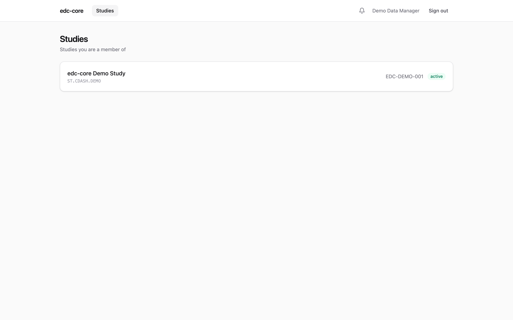
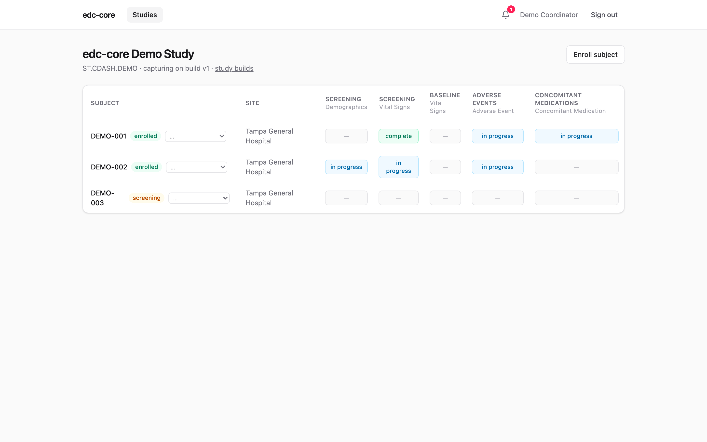
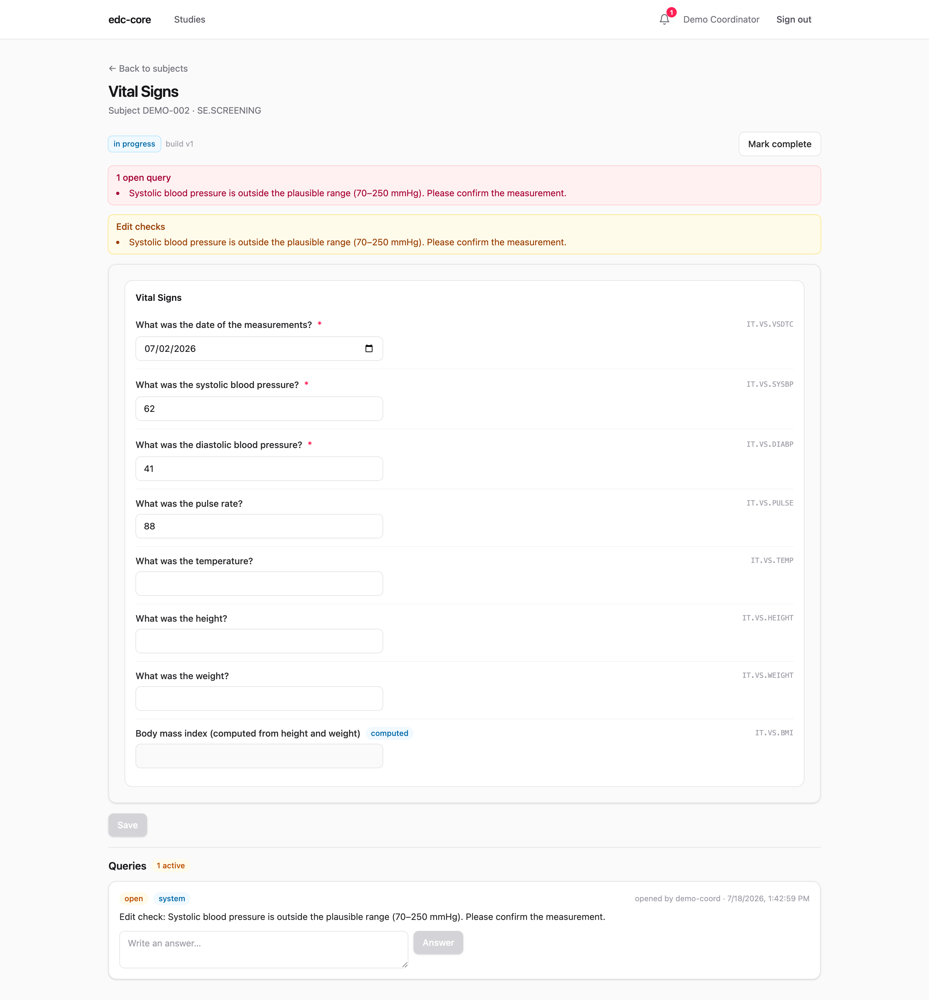
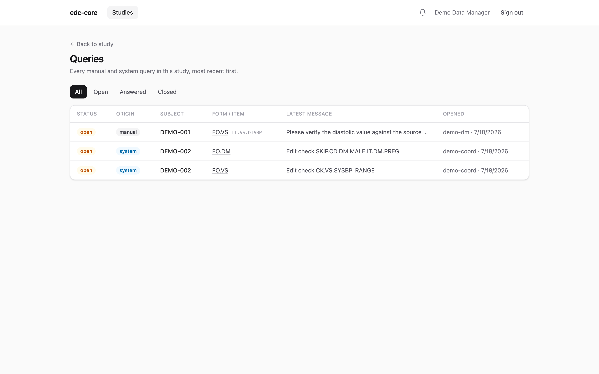
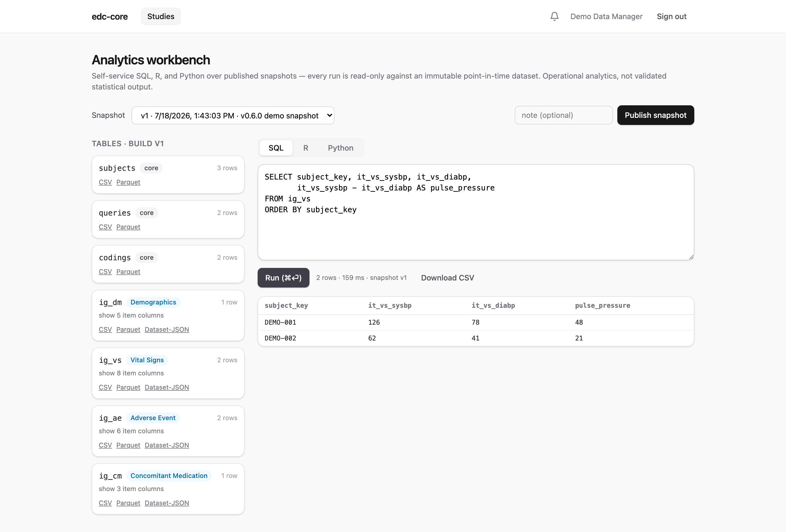
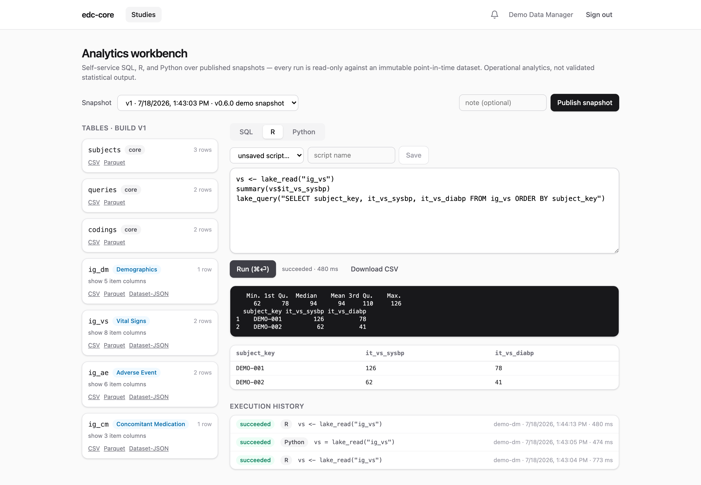

This tour walks the entire clinical data lifecycle on the seeded demo study,
from data entry with edit checks through query resolution, source data
verification, Part 11 signature, snapshot publication, and self-service
analytics, switching between the clinical roles that would perform each step
in a real study.

Prerequisite: a running stack with the demo study seeded
([Installation](/edc-core/installation/)). The demo users are `demo-admin`,
`demo-dm` (data manager), `demo-inv` (investigator), `demo-coord` (site
coordinator), and `demo-cra` (monitor); they share the password printed by
`db:seed-demo`.

## 1. See the study as a coordinator

Sign in as **`demo-coord`**. You land on the studies list. Users only see
studies they've been granted a role on, and site-scoped roles only see their
site's subjects.



Open the study, then **subjects**. The subject matrix shows every subject ×
event × form and its workflow state at a glance, with each subject's
lifecycle status (screening, enrolled, completed, withdrawn) badged next to
their key:



*Full guide: [Data capture](/edc-core/guide/data-capture/).*

## 2. Correct data and watch the query close itself

DEMO-002's Vital Signs form is *in progress* with **1 open query**: the seeded
systolic blood pressure (62 mmHg) failed the plausible-range edit check, which
automatically raised a system query.



Enter a plausible value (say `118`) and save, providing a reason for change:
every modification to saved clinical data requires one, and the prior value
remains visible in the audit trail forever. The edit check now passes, and the
system query **closes automatically**.

Edit checks are JSONata expressions defined in the study build. They run
client-side for instant feedback and server-side as the source of truth.
Checks can also read the subject's *other* forms (an AE onset date against
the visit date, say); those run server-side only and come back marked
**checked on save**. See
[cross-form checks](/edc-core/guide/rules-and-derivations/#cross-form-checks).

The demo study's forms are dynamic, too. On the Demographics form, the
pregnancy-test question only appears while the subject's recorded sex allows
it — record male and it vanishes; and on Vital Signs, the BMI field carries a
**computed** badge: it fills itself in from height and weight, and the server
recomputes and audits it on every save. Try changing a saved sex from female
to male: the recorded pregnancy result is kept, flagged **not collected**,
and a system query stays open until you clear it.

Checks can span forms, too: the demo build compares each adverse event's
onset date against the informed consent date on Demographics. Try it on
DEMO-002:

1. On the Screening **Demographics** form, record an informed consent date
   of `2026-07-01` and save. Nothing fires: the seeded adverse event
   ("stomach ake") started on 2026-07-04, after consent.
2. Open that adverse event from the **Adverse Events** log and change its
   start date to `2026-06-28`, giving a reason for change. The edit-check
   panel flags it, marked *checked on save* — a check that reads another
   form runs only on the server — and a system query opens here, on the AE
   form, where the problem is anchored.
3. Correct either form. Say the consent date was the error: change it to
   `2026-06-15` on Demographics and save. Back on the AE form, the query
   has closed itself: a write to one form re-evaluates the checks that
   read it, wherever their queries live.

*Full guide: [Data capture](/edc-core/guide/data-capture/#conditional-and-computed-fields)
for the entry side, [Rules and derivations](/edc-core/guide/rules-and-derivations/)
for authoring the checks and computations themselves.*

## 3. Verify as a monitor

Sign in as **`demo-cra`** and open the same form. Mark it **verified**. The
workflow state machine (`in progress → complete → verified → signed → locked`)
is enforced server-side, so transitions are only offered when the role and the
current state allow them.

You can also review every query across the study from the **queries**
dashboard:



*Full guide: [Review workflows](/edc-core/guide/review/) and
[Notifications](/edc-core/guide/notifications/).*

## 4. Sign as the investigator

Sign in as **`demo-inv`**, open the completed form, and **sign** it. Part 11
signing requires re-entering your credentials at the moment of signature; the
signature records name, date/time, and meaning, and is cryptographically bound
(SHA-256) to the exact record versions signed. If the form is later reopened
for editing, the signature is invalidated, visibly and irreversibly.

*Full guide: [Review workflows](/edc-core/guide/review/#electronic-signatures-21-cfr-part-11).*

## 5. Review the audit trail

Any create, change, or state transition you just performed is in the study's
**audit trail**: who, when, what changed, and why, filterable and exportable
to CSV. Append-only storage is enforced by database triggers, so history
cannot be rewritten even by a buggy application path.


*Full guide: [Review workflows](/edc-core/guide/review/#audit-trail-review).*

## 6. Publish a snapshot and analyze it

Sign in as **`demo-dm`** and open **analytics**. Click **Publish snapshot**:
this pivots current study data into typed, analysis-ready tables (one per CDISC
item group, plus `subjects` and `queries`) in the study's DuckLake lake. Each
snapshot is an immutable, point-in-time dataset: reruns against snapshot *v1*
return identical results forever.

Run SQL against the pinned snapshot:



Or switch to the **R** or **Python** tab: scripts execute server-side in
sandboxed containers with `lake_read()` / `lake_query()` helpers (data.frames
in R, pandas DataFrames in Python), and every execution is recorded with its
code, logs, and results:



Then close the loop the way a data manager would. A listing that finds
problems can raise queries without re-keying anything. Run:

```sql
SELECT subject_key, event_oid, form_oid, it_vs_sysbp
FROM fo_vs
WHERE it_vs_sysbp > 120
```

Select the flagged rows and click **Create queries…**. The key columns map
themselves, and a dry-run preview shows what each row will do before
anything is written: create a query, or skip with a reason (already
queried, value corrected since the snapshot, form locked). Confirm, and
the queries land on the site's forms as ordinary manual queries. The site
hears about the batch once, and each query records the execution and
snapshot that raised it. Run the preview again and every row now reports
an existing query: the loop does not double-file.

*Full guide: [Analytics workbench](/edc-core/guide/analytics/), and
[From listings to queries](/edc-core/guide/analytics/#from-listings-to-queries)
for this workflow.*

## 7. Export and archive

From the analytics page you can export any snapshot table as **Dataset-JSON
v1.1** (the FDA-accepted exchange format), CSV, or Parquet, or download the
**study archive**: a self-contained zip with the ODM study definition (XML +
JSON), all datasets, the complete audit trail, the signature manifest, and a
PDF casebook for every subject.

*Full guide: [Exports, casebooks, and the study
archive](/edc-core/guide/exports-and-archive/).*

That's the whole loop: capture → clean → verify → sign → snapshot → analyze →
archive, with every step audited. And it is a loop, not a line: the analysis
step raises the next round of cleaning queries itself. For details on any
piece, head to the [user guide](/edc-core/guide/study-builds/) or pick a
[reading track for your role](/edc-core/start-here/).
