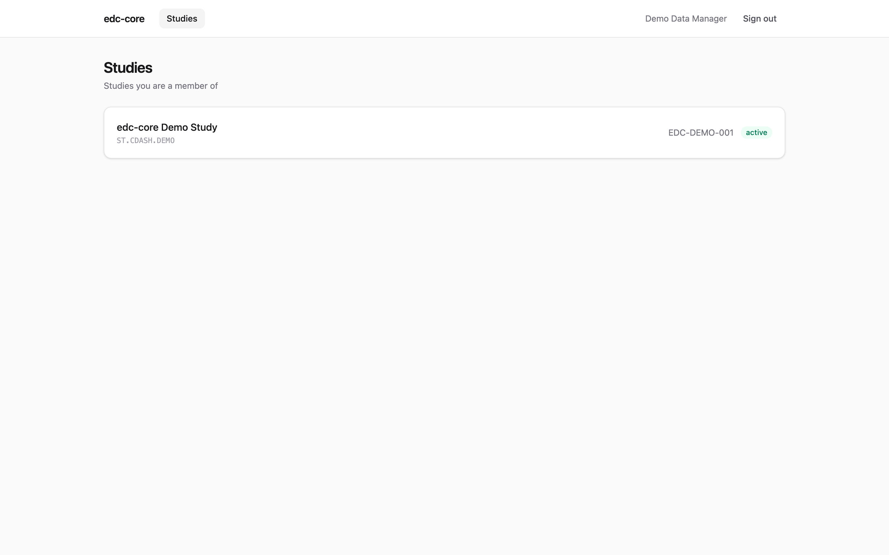
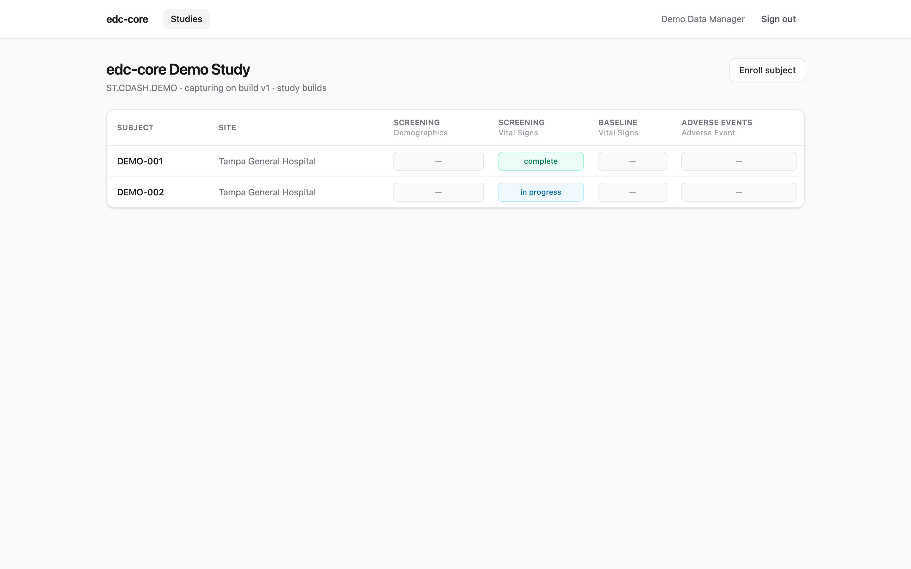
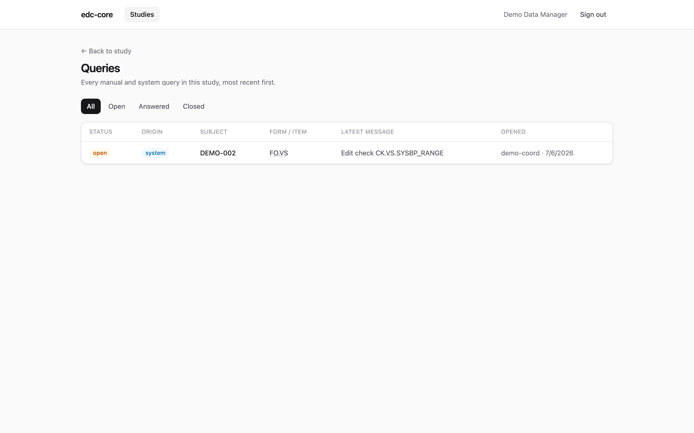
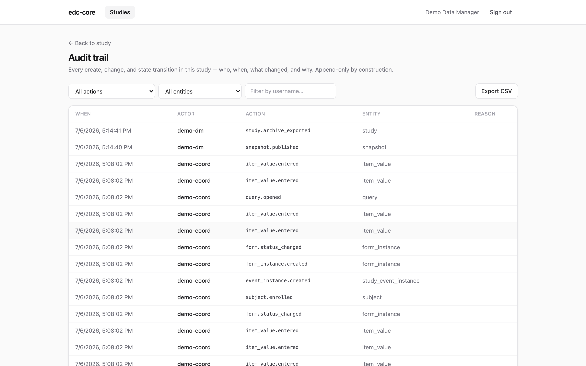
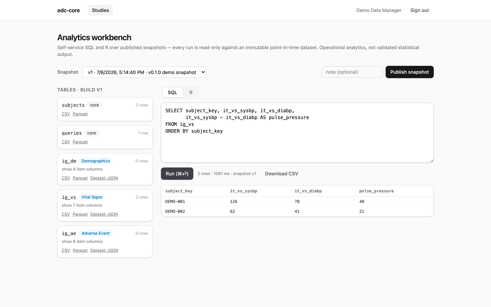
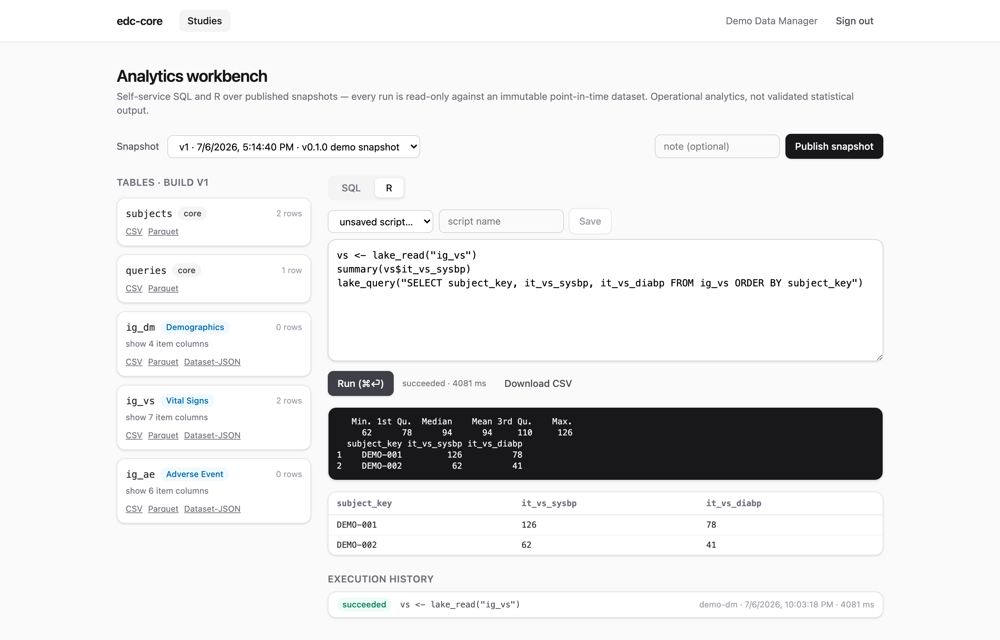

This tour walks the entire clinical data lifecycle on the seeded demo study —
data entry with edit checks, query resolution, source data verification,
Part 11 signature, snapshot publication, and self-service analytics — switching
between the clinical roles that would perform each step in a real study.

Prerequisite: a running stack with the demo study seeded
([Installation](installation.qmd)). The demo users are `demo-admin`,
`demo-dm` (data manager), `demo-inv` (investigator), `demo-coord` (site
coordinator), and `demo-cra` (monitor); they share the password printed by
`db:seed-demo`.

## 1. See the study as a coordinator

Sign in as **`demo-coord`**. You land on the studies list — users only see
studies they've been granted a role on, and site-scoped roles only see their
site's subjects.

{.screenshot fig-alt="Studies list showing the demo study"}

Open the study, then **subjects**. The subject matrix shows every subject ×
event × form and its workflow state at a glance:

{.screenshot fig-alt="Subject matrix with form status per event"}

## 2. Correct data and watch the query close itself

DEMO-002's Vital Signs form is *in progress* with **1 open query**: the seeded
systolic blood pressure (62 mmHg) failed the plausible-range edit check, which
automatically raised a system query.

{.screenshot fig-alt="Vital Signs entry form with an open system query and edit check warnings"}

Enter a plausible value (say `118`) and save, providing a reason for change —
every modification to saved clinical data requires one, and the prior value
remains visible in the audit trail forever. The edit check now passes, and the
system query **closes automatically**.

Edit checks are JSONata expressions defined in the study build. They run
client-side for instant feedback and server-side as the source of truth.

## 3. Verify as a monitor

Sign in as **`demo-cra`** and open the same form. Mark it **verified** — the
workflow state machine (`in progress → complete → verified → signed → locked`)
is enforced server-side, so transitions are only offered when the role and the
current state allow them.

You can also review every query across the study from the **queries**
dashboard:

{.screenshot fig-alt="Study-wide query dashboard"}

## 4. Sign as the investigator

Sign in as **`demo-inv`**, open the completed form, and **sign** it. Part 11
signing requires re-entering your credentials at the moment of signature; the
signature records name, date/time, and meaning, and is cryptographically bound
(SHA-256) to the exact record versions signed. If the form is later reopened
for editing, the signature is invalidated — visibly and irreversibly.

## 5. Review the audit trail

Any create, change, or state transition you just performed is in the study's
**audit trail** — who, when, what changed, and why, filterable and exportable
to CSV. Append-only storage is enforced by database triggers, so history
cannot be rewritten even by a buggy application path.

{.screenshot fig-alt="Audit trail review UI with filters"}

## 6. Publish a snapshot and analyze it

Sign in as **`demo-dm`** and open **analytics**. Click **Publish snapshot**:
this pivots current study data into typed, analysis-ready tables (one per CDISC
item group, plus `subjects` and `queries`) in the study's DuckLake lake. Each
snapshot is an immutable, point-in-time dataset — reruns against snapshot *v1*
return identical results forever.

Run SQL against the pinned snapshot:

{.screenshot fig-alt="SQL workbench with query results"}

Or switch to the **R** tab — scripts execute server-side in a sandboxed
container with `lake_read()` / `lake_query()` helpers, and every execution is
recorded with its code, logs, and results:

{.screenshot fig-alt="R workbench with console output and execution history"}

## 7. Export and archive

From the analytics page you can export any snapshot table as **Dataset-JSON
v1.1** (the FDA-accepted exchange format), CSV, or Parquet — or download the
**study archive**: a self-contained zip with the ODM study definition (XML +
JSON), all datasets, the complete audit trail, and the signature manifest.

That's the whole loop: capture → clean → verify → sign → snapshot → analyze →
archive, with every step audited. For details on any piece, head to the
[user guide](guide/study-builds.qmd).
